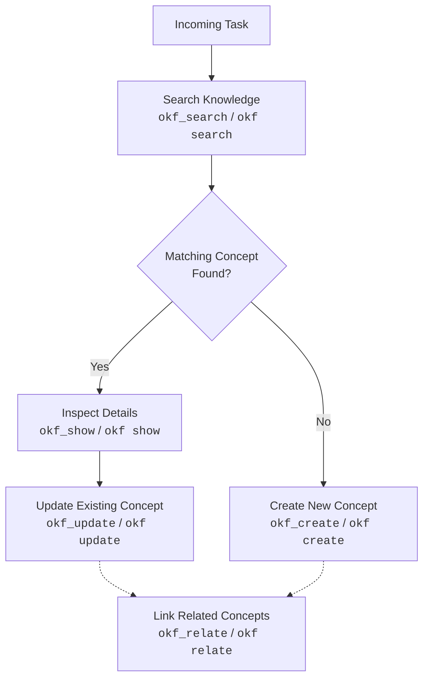
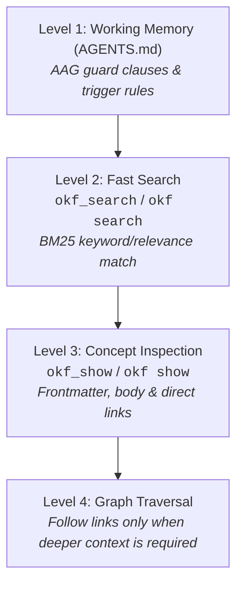

# Discovery & Exploration Guide

Persistent memory is only useful if agents read existing knowledge before acting. This guide explains how to discover, search, and navigate an OKF v0.2 knowledge bundle efficiently without overflowing context windows.

---

## 1. Core Principle: Read Before Write

Before writing code, making architectural choices, or adding new memory concepts:
1. **Search existing memory**: Always query the knowledge base first.
2. **Reuse & Extend**: If a concept already covers the topic, update it instead of creating duplicates.
3. **Verify Context**: Inspect existing constraints, requirements, and past decisions.



---

## 2. Progressive Disclosure Pattern

To prevent blowing up the LLM context window with large repositories, follow the **Progressive Disclosure** pattern:



### Context Rules & Negative Constraints
- **NO Blanket Scans**: Never run `list_dir`, `grep_search`, or `view_file` over the entire `knowledge/` folder.
- **Prefer Native MCP Tools**: Use `okf_search` and `okf_show` if available. MCP tool calls avoid subshell spawning, execute in-process, and consume significantly less context tokens than CLI output.
- **Search First, Load on Demand**: Always run `okf_search(query="<query>", limit=3)` (or `okf search "<query>" knowledge --limit 3 --json`) to get lightweight metadata.
- **Selective Inspection**: Read the 1-sentence `description` in search hits first; only fetch the full body with `okf_show(concept_id="<id>")` (or `okf show <id>`) if the concept is genuinely needed.
- **Task Relevance**: Do not proactively scan `knowledge/` for trivial code tasks unless relevant to architectural decisions, requirements, or explicitly requested.

---

## 3. Search & Inspection Reference

### Search the Corpus
Execute fast in-memory BM25 searches across concept titles, IDs, descriptions, and bodies:

#### Option A: Native MCP Tool (Preferred)
```json
// Tool: okf_search
{
  "query": "authentication jwt",
  "limit": 3
}
```

#### Option B: CLI Fallback
```bash
# Agent JSON mode (structured output with scores & snippets)
okf search "authentication jwt" knowledge --limit 3 --json

# Human-readable search
okf search "authentication jwt" knowledge
```

**Output Example**:
```json
{
  "query": "authentication jwt",
  "total_hits": 1,
  "results": [
    {
      "id": "architecture/auth",
      "path": "knowledge/architecture/auth.md",
      "title": "Authentication Architecture",
      "type": "Architecture",
      "description": "JWT-based stateless auth mechanism with refresh tokens.",
      "score": 4.82,
      "snippet": "All API endpoints authenticate via standard JWT Bearer tokens..."
    }
  ]
}
```

### Pre-Edit Scope & Code Lookup (`for_path`)
Before modifying code in a subsystem or module, query governing concepts to uncover mandatory constraints or active holds:

#### Option A: Native MCP Tool (Preferred)
```json
// Tool: okf_search
{
  "for_path": "pkg/auth/"
}
```

#### Option B: CLI Fallback
```bash
# Discover constraints and holds governing a target path
okf search --for-path pkg/auth/ knowledge --json
```

**Output Example**:
```json
[
  {
    "concept_id": "architecture/auth-v2",
    "title": "Auth Subsystem Freeze",
    "type": "architecture",
    "description": "Refactoring in progress, do not modify without signoff.",
    "governance": "hold",
    "code_refs": ["pkg/auth/*"],
    "score": 30.0,
    "matched_on": ["code_refs"]
  }
]
```

### Inspect Concept Details
Retrieve a single concept with its metadata, parsed frontmatter, and outward/inward links:

#### Option A: Native MCP Tool (Preferred)
```json
// Tool: okf_show
{
  "concept_id": "architecture/auth"
}
```

#### Option B: CLI Fallback
```bash
# Agent JSON mode
okf show architecture/auth knowledge --json

# Human-readable show
okf show architecture/auth knowledge
```

**JSON Output Example**:
```json
{
  "id": "architecture/auth",
  "path": "knowledge/architecture/auth.md",
  "type": "Architecture",
  "title": "Authentication Architecture",
  "description": "JWT-based stateless auth mechanism with refresh tokens.",
  "status": "active",
  "sources": ["docs/RFC-004.md"],
  "generated": {
    "by": "claude-code/v1.0",
    "at": "2026-09-01T10:00:00Z"
  },
  "content": "All API endpoints authenticate via standard JWT Bearer tokens...",
  "relationships": [
    {
      "target": "decisions/jwt-rotation",
      "description": "relies on key rotation policy"
    }
  ]
}
```

---

## 4. Discovery Checklist for Agents

When starting any new task, run through this quick checklist:
- [ ] Am I triggered by an AAG guard clause (`ON edit(@path/)` or explicit user query)?
- [ ] Have I searched for keywords related to the feature or bug (`okf_search` or `okf search "<keywords>"`)?
- [ ] Have I checked governance for target paths (`okf_search(for_path="<path>")`)?
- [ ] Have I inspected only genuinely relevant concepts (`okf_show`), rather than dumping files?
- [ ] Did I avoid blanket scans of `knowledge/` via `list_dir` or raw file readers?
