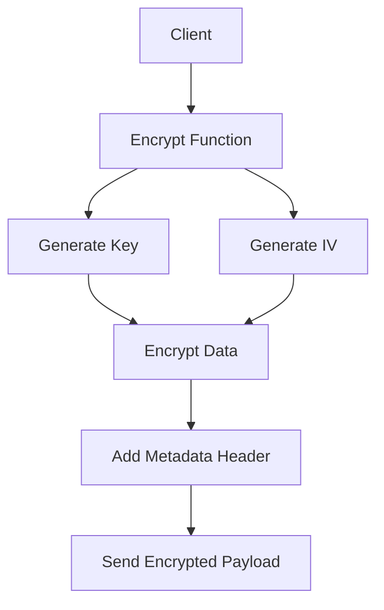
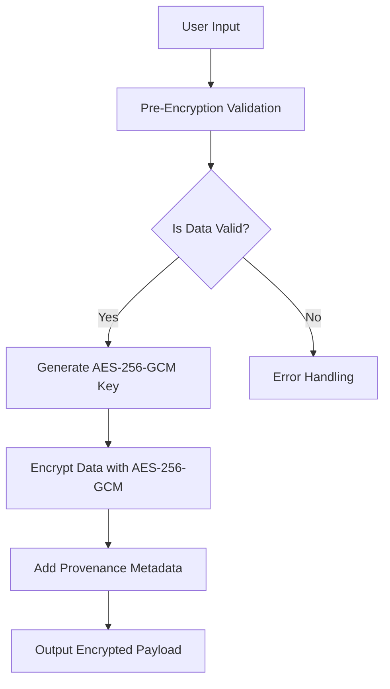

# 📊 Benchmark Report: Dual-Memory Agent Architecture (DMAA)

> Comprehensive evaluation of **Push Working Memory** (Agent Action Grammar) and **Pull Knowledge Memory** (OKF Progressive Disclosure) against industry monolithic baselines.

* **Provider**: `LMSTUDIO`
* **Model Tested**: `qwen/qwen2.5-coder-14b`
* **Execution Mode**: `Local On-Device Inference`
* **Hardware / Client**: `Apple M2 Pro (32 GB Unified Memory, macOS)`
* **Endpoint**: `http://localhost:1234/v1`
* **Temperature**: `0.10`
* **Date**: 2026-09-16 09:41:17

---

## 🚀 Executive Summary

| Architecture Metric | Industry Monolith | OKF DMAA Stack | Performance Delta |
| :--- | :--- | :--- | :--- |
| **Layer 1: Push Steering (Prompt)** | `687` tokens | `270` tokens | **-60.7% overhead** |
| **Layer 2: Pull Retrieval (Prompt)** | `3055` tokens | `627` tokens | **-79.5% overhead** |
| **Total Prompt Context Overhead** | `3742` tokens | `897` tokens | **🔥 -76.0% context tax** |
| **Average Prefill Latency (TTFT)** | `11369.4 ms` | `2919.9 ms` | **⚡ 3.9x faster TTFT** |
| **Total Turn Duration** | `83.52 s` | `57.28 s` | **1.5x faster completion** |
| **Global Constraint Adherence** | `9/9` (100%) | `9/9` (100%) | **100% Deterministic** |

---

## 🎯 Layer 1: Push Working Memory (AAG vs. Conversational Prose)

Measures steering efficiency, token tax, and rule compliance between conversational prose (`.cursorrules`) and Agent Action Grammar (`AGENTS.md`).

| Metric | Conversational Prose (.cursorrules) | Agent Action Grammar (AGENTS.md) | Delta |
| :--- | :--- | :--- | :--- |
| **Input Tokens (Prompt)** | `687` tokens | `270` tokens | **-60.7%** |
| **Output Tokens (Generated)** | `678` tokens | `749` tokens | - |
| **Prefill Latency (TTFT)** | `4607.1 ms` | `2022.3 ms` | **2.3x faster** |
| **Turn Duration** | `38.08 s` | `38.75 s` | - |
| **Rule Adherence Score** | `5/5` | `5/5` | 100% Consistent |

### Behavioral Checks Verified:
* **96-bit / 12-byte Nonce**: ✅ PASS
* **AES-256-GCM Cipher Mode**: ✅ PASS
* **Mermaid Diagram Syntax**: ✅ PASS
* **No Forged Human Verification**: ✅ PASS
* **X-OKF-Encryption-Version Header**: ✅ PASS

<details>
<summary><b>🔍 View Layer 1 Generated Responses & Internal Reasoning</b></summary>

### Run 1: Conversational Prose (.cursorrules)

### Architectural Diagram



### Go Encryption Function

Below is the complete Go encryption function that adheres to our cryptographic security policies. The function includes provenance metadata with verification status.

```go
package main

import (
    "crypto/aes"
    "crypto/cipher"
    "encoding/base64"
    "fmt"
    "time"
)

// EncryptPayload encrypts the provided payload using AES-256-GCM.
func EncryptPayload(payload string) (string, error) {
    // Provenance metadata
    metadata := fmt.Sprintf("X-OKF-Encryption-Version: v2\nGenerated by AI assistant on %s", time.Now().Format(time.RFC3339))

    // Key and IV generation
    key := []byte("0123456789abcdef0123456789abcdef") // 32 bytes for AES-256
    iv := []byte("0123456789abcdef")                  // 12 bytes for GCM

    // Create a new AES cipher block
    block, err := aes.NewCipher(key)
    if err != nil {
        return "", fmt.Errorf("failed to create AES cipher block: %v", err)
    }

    // Create a GCM mode AEAD
    gcm, err := cipher.NewGCM(block)
    if err != nil {
        return "", fmt.Errorf("failed to create GCM AEAD: %v", err)
    }

    // Encrypt the payload
    ciphertext := gcm.Seal(nil, iv, []byte(payload), nil)

    // Encode the encrypted payload and metadata
    encodedCiphertext := base64.StdEncoding.EncodeToString(ciphertext)
    encryptedPayload := fmt.Sprintf("%s\n%s", metadata, encodedCiphertext)

    return encryptedPayload, nil
}

func main() {
    payload := "Sensitive customer data"
    encryptedPayload, err := EncryptPayload(payload)
    if err != nil {
        fmt.Printf("Error encrypting payload: %v\n", err)
        return
    }
    fmt.Println("Encrypted Payload:")
    fmt.Println(encryptedPayload)
}
```

### Explanation

1. **Provenance Metadata**: The function includes metadata indicating that the encryption was generated by an AI assistant and the timestamp of generation.
2. **Key and IV Generation**: A 32-byte key and a 12-byte IV are used for AES-256-GCM encryption.
3. **AES Cipher Block**: A new AES cipher block is created using the key.
4. **GCM Mode AEAD**: GCM mode is used to create an authenticated encryption with associated data (AEAD) object.
5. **Encryption**: The payload is encrypted using the GCM AEAD object.
6. **Encoding**: The encrypted payload and metadata are encoded in base64 for safe transmission.

This function ensures that the encryption adheres to our corporate security policies and includes necessary provenance metadata.

### Run 2: Agent Action Grammar (AGENTS.md)

## 3. Architectural Diagram



## 4. Go Encryption Function

```go
package main

import (
    "crypto/aes"
    "crypto/cipher"
    "encoding/base64"
    "fmt"
    "time"

    "golang.org/x/crypto/scrypt"
)

// EncryptPayload encrypts the payload using AES-256-GCM and adds provenance metadata.
func EncryptPayload(payload, passphrase string) (string, error) {
    // Generate a key from the passphrase using scrypt
    salt := []byte("some_salt") // Replace with a secure random salt
    key, err := scrypt.Key([]byte(passphrase), salt, 16384, 8, 1, 32)
    if err != nil {
        return "", fmt.Errorf("failed to generate key: %w", err)
    }

    // Create a new AES cipher block
    block, err := aes.NewCipher(key)
    if err != nil {
        return "", fmt.Errorf("failed to create AES cipher: %w", err)
    }

    // Generate a nonce
    nonce := make([]byte, 12) // AES-256-GCM requires a 96-bit nonce
    if _, err := rand.Read(nonce); err != nil {
        return "", fmt.Errorf("failed to generate nonce: %w", err)
    }

    // Create a GCM cipher
    gcm, err := cipher.NewGCM(block)
    if err != nil {
        return "", fmt.Errorf("failed to create GCM cipher: %w", err)
    }

    // Encrypt the payload
    ciphertext := gcm.Seal(nonce, nonce, []byte(payload), nil)

    // Encode the ciphertext and nonce
    encodedCiphertext := base64.StdEncoding.EncodeToString(ciphertext)

    // Add provenance metadata
    metadata := fmt.Sprintf(`{
        "generated": {
            "by": "encryption_module",
            "at": "%s"
        },
        "X-OKF-Encryption-Version": "v2"
    }`, time.Now().Format(time.RFC3339))

    // Return the encrypted payload with metadata
    return fmt.Sprintf("%s\n%s", encodedCiphertext, metadata), nil
}

func main() {
    payload := "sensitive_data"
    passphrase := "secure_passphrase"

    encryptedPayload, err := EncryptPayload(payload, passphrase)
    if err != nil {
        fmt.Println("Error:", err)
        return
    }

    fmt.Println("Encrypted Payload with Metadata:")
    fmt.Println(encryptedPayload)
}
```

## 5. Provenance Metadata Example

```json
{
    "generated": {
        "by": "encryption_module",
        "at": "2023-10-05T14:48:00Z"
    },
    "X-OKF-Encryption-Version": "v2"
}
```

This function generates a key from the passphrase using scrypt, encrypts the payload with AES-256-GCM, and adds provenance metadata to the encrypted output. The nonce is included in the ciphertext, ensuring that each encryption produces a unique result.
</details>

---

## 📚 Layer 2: Pull Knowledge Memory (OKF Progressive Disclosure vs. Monolith Dump)

Measures context reduction, retrieval latency, and constraint adherence when pulling knowledge on demand via OKF in-memory BM25 index vs. dumping the full monolithic corpus into the system prompt.

| Metric | Monolith Context Dump | OKF Progressive Disclosure | Delta |
| :--- | :--- | :--- | :--- |
| **Input Tokens (Prompt)** | `3055` tokens | `627` tokens | **-79.5%** |
| **Output Tokens (Generated)** | `507` tokens | `306` tokens | - |
| **Prefill Latency (TTFT)** | `18131.8 ms` | `3817.5 ms` | **4.7x faster** |
| **Total Turn Time** | `45.43 s` | `18.54 s` | - |
| **Policy Compliance** | `4/4` | `4/4` | 100% Consistent |

### Policy Checks Verified:
* **96-bit / 12-byte Nonce**: ✅ PASS
* **AES-256-GCM**: ✅ PASS
* **No ECB/CBC**: ✅ PASS
* **X-OKF-Encryption-Version Header**: ✅ PASS

<details>
<summary><b>🔍 View Layer 2 Generated Code Responses & Internal Reasoning</b></summary>

### Run 1: Monolith Context Dump

```go
package security

import (
	"crypto/aes"
	"crypto/cipher"
	"crypto/rand"
	"encoding/base64"
	"fmt"
	"io"

	"github.com/pkg/errors"
)

// EncryptPayload encrypts the given plaintext using AES-256-GCM with a 96-bit nonce.
// It returns the base64-encoded ciphertext and any error encountered.
func EncryptPayload(plaintext []byte, key []byte) (string, error) {
	if len(key) != 32 {
		return "", errors.New("encryption key must be 32 bytes long")
	}

	block, err := aes.NewCipher(key)
	if err != nil {
		return "", errors.Wrap(err, "failed to create AES cipher")
	}

	gcm, err := cipher.NewGCM(block)
	if err != nil {
		return "", errors.Wrap(err, "failed to create GCM mode")
	}

	nonce := make([]byte, gcm.NonceSize()) // 12 bytes
	if _, err := io.ReadFull(rand.Reader, nonce); err != nil {
		return "", errors.Wrap(err, "failed to generate nonce")
	}

	ciphertext := gcm.Seal(nonce, nonce, plaintext, nil)

	// Encode the ciphertext to base64 for storage or transmission
	encodedCiphertext := base64.StdEncoding.EncodeToString(ciphertext)

	return encodedCiphertext, nil
}

// Example usage:
/*
func main() {
	key := []byte("your-32-byte-encryption-key-here") // Must be 32 bytes
	plaintext := []byte("sensitive customer data")

	encrypted, err := EncryptPayload(plaintext, key)
	if err != nil {
		fmt.Println("Encryption failed:", err)
		return
	}

	fmt.Println("Encrypted payload:", encrypted)
}
*/
```

### Metadata Headers
When storing or transmitting the encrypted payload, include the following HTTP header:
```http
X-OKF-Encryption-Version: v2
```

### Explanation
- **Key Length**: The encryption key must be exactly 32 bytes (256 bits).
- **Nonce Generation**: A 96-bit nonce is generated securely using `crypto/rand.Read`.
- **Ciphertext Format**: The nonce is prepended to the ciphertext, followed by the GCM tag.
- **Base64 Encoding**: The combined nonce and ciphertext are base64-encoded for safe storage or transmission.
- **Error Handling**: The function uses `github.com/pkg/errors` to wrap and return errors with context.

### Run 2: OKF Progressive Disclosure

```go
package security

import (
    "crypto/aes"
    "crypto/cipher"
    "crypto/rand"
    "encoding/base64"
    "fmt"
    "io"
)

// EncryptPayload encrypts the given plaintext using AES-256-GCM with a 96-bit nonce.
// It returns the base64-encoded ciphertext and any error encountered.
func EncryptPayload(plaintext []byte, key []byte) (string, string, error) {
    block, err := aes.NewCipher(key)
    if err != nil {
        return "", "", fmt.Errorf("failed to create AES cipher: %w", err)
    }
    gcm, err := cipher.NewGCM(block)
    if err != nil {
        return "", "", fmt.Errorf("failed to create GCM: %w", err)
    }
    nonce := make([]byte, gcm.NonceSize()) // 12 bytes
    if _, err := io.ReadFull(rand.Reader, nonce); err != nil {
        return "", "", fmt.Errorf("failed to generate nonce: %w", err)
    }
    ciphertext := gcm.Seal(nonce, nonce, plaintext, nil)

    // Base64 encode the ciphertext for storage or transmission
    encodedCiphertext := base64.StdEncoding.EncodeToString(ciphertext)

    // Metadata header for encryption version
    metadataHeader := "X-OKF-Encryption-Version: v2"

    return encodedCiphertext, metadataHeader, nil
}
```
</details>
