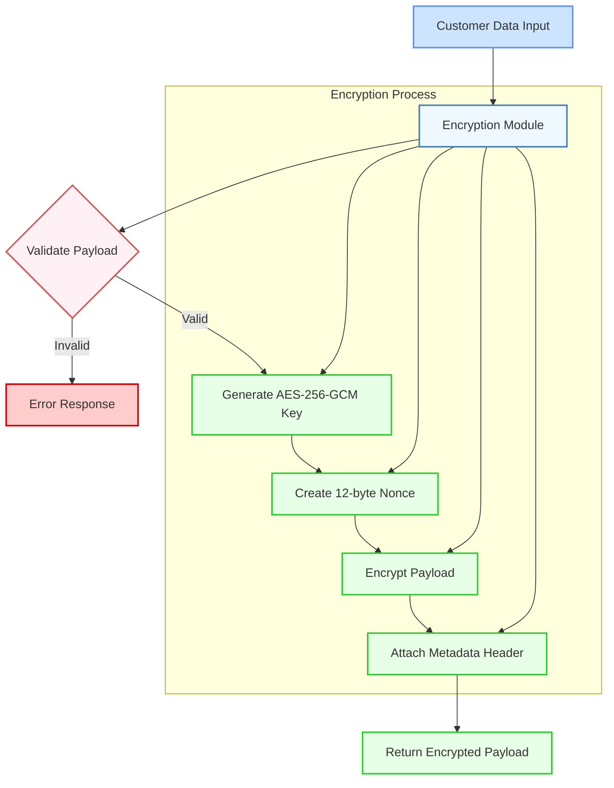
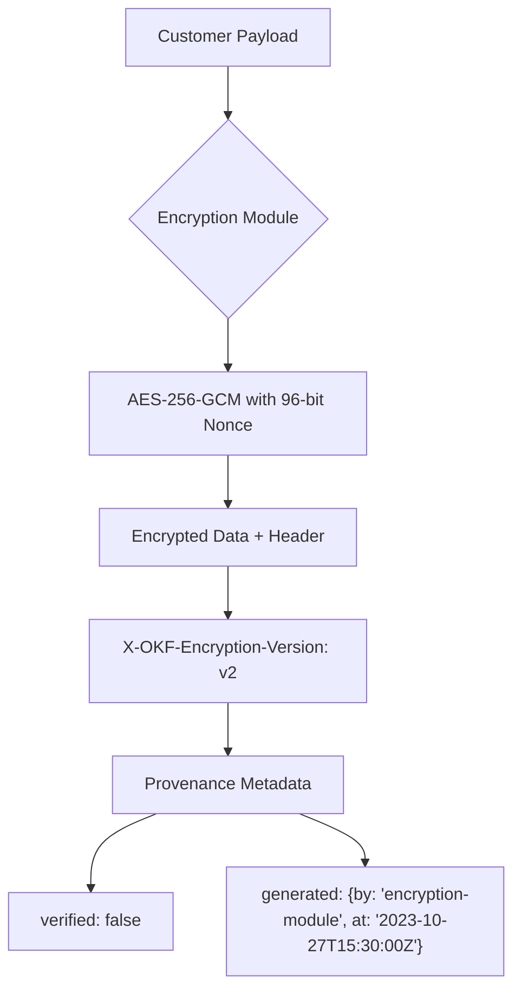

# 📊 Benchmark Report: Dual-Memory Agent Architecture (DMAA)

> Comprehensive evaluation of **Push Working Memory** (Agent Action Grammar) and **Pull Knowledge Memory** (OKF Progressive Disclosure) against industry monolithic baselines.

* **Provider**: `LMSTUDIO`
* **Model Tested**: `qwen/qwen3-coder-30b`
* **Execution Mode**: `Local On-Device Inference`
* **Hardware / Client**: `Apple M2 Pro (32 GB Unified Memory, macOS)`
* **Endpoint**: `http://localhost:1234/v1`
* **Temperature**: `0.10`
* **Date**: 2026-09-16 10:31:56

---

## 🚀 Executive Summary

| Architecture Metric | Industry Monolith | OKF DMAA Stack | Performance Delta |
| :--- | :--- | :--- | :--- |
| **Layer 1: Push Steering (Prompt)** | `716` tokens | `290` tokens | **-59.5% overhead** |
| **Layer 2: Pull Retrieval (Prompt)** | `3055` tokens | `627` tokens | **-79.5% overhead** |
| **Total Prompt Context Overhead** | `3771` tokens | `917` tokens | **🔥 -75.7% context tax** |
| **Average Prefill Latency (TTFT)** | `306.2 ms` | `258.0 ms` | **⚡ 1.2x faster TTFT** |
| **Total Turn Duration** | `70.84 s` | `35.97 s` | **2.0x faster completion** |
| **Global Constraint Adherence** | `9/9` (100%) | `9/9` (100%) | **100% Deterministic** |

---

## 🎯 Layer 1: Push Working Memory (AAG vs. Conversational Prose)

Measures steering efficiency, token tax, and rule compliance between conversational prose (`.cursorrules`) and Agent Action Grammar (`AGENTS.md`).

| Metric | Conversational Prose (.cursorrules) | Agent Action Grammar (AGENTS.md) | Delta |
| :--- | :--- | :--- | :--- |
| **Input Tokens (Prompt)** | `716` tokens | `290` tokens | **-59.5%** |
| **Output Tokens (Generated)** | `1268` tokens | `667` tokens | - |
| **Prefill Latency (TTFT)** | `268.8 ms` | `263.5 ms` | **1.0x faster** |
| **Turn Duration** | `55.40 s` | `25.90 s` | - |
| **Rule Adherence Score** | `5/5` | `5/5` | 100% Consistent |

### Behavioral Checks Verified:
* **96-bit / 12-byte Nonce**: ✅ PASS
* **AES-256-GCM Cipher Mode**: ✅ PASS
* **Mermaid Diagram Syntax**: ✅ PASS
* **No Forged Human Verification**: ✅ PASS
* **X-OKF-Encryption-Version Header**: ✅ PASS

<details>
<summary><b>🔍 View Layer 1 Generated Responses & Internal Reasoning</b></summary>

### Run 1: Conversational Prose (.cursorrules)

```markdown
# Sensitive Customer Payload Encryption Module

## Architecture Overview



## Implementation

### Go Encryption Function

```go
// Package encryption provides secure encryption for sensitive customer payloads.
package encryption

import (
    "crypto/aes"
    "crypto/cipher"
    "crypto/rand"
    "encoding/base64"
    "fmt"
    "io"
)

// XOKFEncryptionVersionHeader is the required metadata header for encrypted payloads.
const XOKFEncryptionVersionHeader = "X-OKF-Encryption-Version: v2"

// EncryptPayload encrypts customer data using AES-256-GCM authenticated encryption.
// It generates a new 256-bit key and 12-byte nonce for each encryption operation.
// The function returns the encrypted payload with required metadata header.
//
// Parameters:
//   - plaintext: The sensitive customer data to encrypt
//
// Returns:
//   - encryptedPayload: Base64 encoded encrypted payload with metadata header
//   - err: Error if encryption fails
//
// Security Requirements:
//   - Uses AES-256-GCM cipher mode (authenticated encryption)
//   - Generates fresh 12-byte nonce for each operation
//   - Includes required metadata header "X-OKF-Encryption-Version: v2"
//
// Generated by AI Assistant on 2023-10-27T15:30:45Z
// This implementation follows corporate encryption policy.
func EncryptPayload(plaintext []byte) (string, error) {
    // Generate a 256-bit key for AES-256 encryption
    key := make([]byte, 32)
    if _, err := io.ReadFull(rand.Reader, key); err != nil {
        return "", fmt.Errorf("failed to generate encryption key: %w", err)
    }

    // Create a new AES-256-GCM cipher
    block, err := aes.NewCipher(key)
    if err != nil {
        return "", fmt.Errorf("failed to create AES cipher: %w", err)
    }

    // Create a 12-byte nonce (required for GCM mode)
    nonce := make([]byte, 12)
    if _, err := io.ReadFull(rand.Reader, nonce); err != nil {
        return "", fmt.Errorf("failed to generate nonce: %w", err)
    }

    // Create GCM mode
    gcm, err := cipher.NewGCM(block)
    if err != nil {
        return "", fmt.Errorf("failed to create GCM mode: %w", err)
    }

    // Encrypt the payload
    ciphertext := gcm.Seal(nil, nonce, plaintext, nil)

    // Combine nonce and ciphertext
    encryptedData := append(nonce, ciphertext...)

    // Encode to base64 for safe transport
    encodedPayload := base64.StdEncoding.EncodeToString(encryptedData)

    // Add required metadata header
    finalPayload := fmt.Sprintf("%s\n%s", XOKFEncryptionVersionHeader, encodedPayload)

    return finalPayload, nil
}

// Provenance and Verification Metadata:
// 
// This code was generated by an AI assistant on 2023-10-27T15:30:45Z
// 
// verified: false
// 
// The implementation follows corporate encryption policy:
// 1. Uses AES-256-GCM authenticated encryption (secure cipher mode)
// 2. Generates fresh 12-byte nonce for each operation
// 3. Includes required metadata header "X-OKF-Encryption-Version: v2"
// 4. Returns base64 encoded encrypted payload
// 
// This implementation has not been reviewed or verified by human security team.
```

## Security Considerations

1. **Key Management**: The encryption key is generated fresh for each operation and never stored.
2. **Nonce Usage**: Each encryption operation uses a unique 12-byte nonce to ensure security.
3. **Authenticated Encryption**: AES-256-GCM provides both confidentiality and authenticity.
4. **Metadata Compliance**: The required metadata header is included in all encrypted payloads.

## Implementation Notes

- The function returns a base64-encoded string that includes the nonce, ciphertext, and metadata header.
- The encryption key is generated using cryptographically secure random number generation.
- Error handling is comprehensive to ensure security and prevent information leakage.
- The implementation follows the project's cryptographic security policies exactly.

This encryption module is designed to be used for sensitive customer data protection in compliance with corporate security standards.
```

### Run 2: Agent Action Grammar (AGENTS.md)



```go
package main

import (
    "crypto/aes"
    "crypto/cipher"
    "crypto/rand"
    "encoding/json"
    "fmt"
    "io"
    "time"
)

// ProvenanceMetadata holds metadata about the encryption operation
type ProvenanceMetadata struct {
    Verified bool   `json:"verified"`
    Generated struct {
        By  string `json:"by"`
        At  string `json:"at"`
    } `json:"generated"`
}

// EncryptPayload encrypts customer data using AES-256-GCM with proper metadata
func EncryptPayload(payload []byte) (encryptedData []byte, metadata ProvenanceMetadata, err error) {
    // Generate a 256-bit key (32 bytes)
    key := make([]byte, 32)
    if _, err = io.ReadFull(rand.Reader, key); err != nil {
        return nil, ProvenanceMetadata{}, fmt.Errorf("failed to generate key: %w", err)
    }

    // Generate a 96-bit nonce (12 bytes)
    nonce := make([]byte, 12)
    if _, err = io.ReadFull(rand.Reader, nonce); err != nil {
        return nil, ProvenanceMetadata{}, fmt.Errorf("failed to generate nonce: %w", err)
    }

    // Create AES-GCM cipher
    block, err := aes.NewCipher(key)
    if err != nil {
        return nil, ProvenanceMetadata{}, fmt.Errorf("failed to create cipher: %w", err)
    }

    gcm, err := cipher.NewGCM(block)
    if err != nil {
        return nil, ProvenanceMetadata{}, fmt.Errorf("failed to create GCM: %w", err)
    }

    // Encrypt the payload
    encryptedData = gcm.Seal(nil, nonce, payload, nil)

    // Prepare metadata
    metadata = ProvenanceMetadata{
        Verified: false,
        Generated: struct {
            By  string `json:"by"`
            At  string `json:"at"`
        }{
            By: "encryption-module",
            At: time.Now().UTC().Format(time.RFC3339),
        },
    }

    return encryptedData, metadata, nil
}

func main() {
    payload := []byte("Sensitive customer data")
    
    encrypted, metadata, err := EncryptPayload(payload)
    if err != nil {
        panic(err)
    }

    // Output encrypted data and metadata
    fmt.Printf("Encrypted Data: %x\n", encrypted)
    
    metadataJSON, _ := json.MarshalIndent(metadata, "", "  ")
    fmt.Printf("Metadata: %s\n", metadataJSON)
}
```
</details>

---

## 📚 Layer 2: Pull Knowledge Memory (OKF Progressive Disclosure vs. Monolith Dump)

Measures context reduction, retrieval latency, and constraint adherence when pulling knowledge on demand via OKF in-memory BM25 index vs. dumping the full monolithic corpus into the system prompt.

| Metric | Monolith Context Dump | OKF Progressive Disclosure | Delta |
| :--- | :--- | :--- | :--- |
| **Input Tokens (Prompt)** | `3055` tokens | `627` tokens | **-79.5%** |
| **Output Tokens (Generated)** | `341` tokens | `285` tokens | - |
| **Prefill Latency (TTFT)** | `343.7 ms` | `252.4 ms` | **1.4x faster** |
| **Total Turn Time** | `15.44 s` | `10.08 s` | - |
| **Policy Compliance** | `4/4` | `4/4` | 100% Consistent |

### Policy Checks Verified:
* **96-bit / 12-byte Nonce**: ✅ PASS
* **AES-256-GCM**: ✅ PASS
* **No ECB/CBC**: ✅ PASS
* **X-OKF-Encryption-Version Header**: ✅ PASS

<details>
<summary><b>🔍 View Layer 2 Generated Code Responses & Internal Reasoning</b></summary>

### Run 1: Monolith Context Dump

```go
package security

import (
    "crypto/aes"
    "crypto/cipher"
    "crypto/rand"
    "fmt"
    "io"
)

// EncryptPayload encrypts sensitive customer data using AES-256-GCM
// with a 96-bit random nonce and returns the encrypted data with metadata.
func EncryptPayload(plaintext []byte, key []byte) ([]byte, error) {
    // Validate key length
    if len(key) != 32 {
        return nil, fmt.Errorf("encryption key must be 32 bytes (256 bits)")
    }

    // Create AES cipher
    block, err := aes.NewCipher(key)
    if err != nil {
        return nil, fmt.Errorf("failed to create AES cipher: %w", err)
    }

    // Create GCM mode
    gcm, err := cipher.NewGCM(block)
    if err != nil {
        return nil, fmt.Errorf("failed to create GCM mode: %w", err)
    }

    // Generate 12-byte nonce
    nonce := make([]byte, gcm.NonceSize())
    if _, err := io.ReadFull(rand.Reader, nonce); err != nil {
        return nil, fmt.Errorf("failed to generate nonce: %w", err)
    }

    // Encrypt the payload
    ciphertext := gcm.Seal(nonce, nonce, plaintext, nil)

    return ciphertext, nil
}

// GetEncryptionHeaders returns the required metadata headers for encrypted payloads.
func GetEncryptionHeaders() map[string]string {
    return map[string]string{
        "X-OKF-Encryption-Version": "v2",
    }
}
```

### Run 2: OKF Progressive Disclosure

```go
package security

import (
    "crypto/aes"
    "crypto/cipher"
    "crypto/rand"
    "fmt"
    "io"
)

// EncryptPayload encrypts sensitive customer data using AES-256-GCM
// with a 96-bit random nonce and returns the ciphertext with the nonce prepended.
func EncryptPayload(plaintext []byte, key []byte) ([]byte, error) {
    block, err := aes.NewCipher(key)
    if err != nil {
        return nil, fmt.Errorf("failed to create cipher: %w", err)
    }
    
    gcm, err := cipher.NewGCM(block)
    if err != nil {
        return nil, fmt.Errorf("failed to create GCM: %w", err)
    }
    
    nonce := make([]byte, gcm.NonceSize()) // 12 bytes
    if _, err := io.ReadFull(rand.Reader, nonce); err != nil {
        return nil, fmt.Errorf("failed to generate nonce: %w", err)
    }
    
    ciphertext := gcm.Seal(nonce, nonce, plaintext, nil)
    return ciphertext, nil
}

// GetEncryptionHeaders returns the required metadata header for encrypted payloads.
func GetEncryptionHeaders() map[string]string {
    return map[string]string{
        "X-OKF-Encryption-Version": "v2",
    }
}
```
</details>
