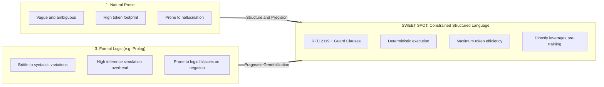
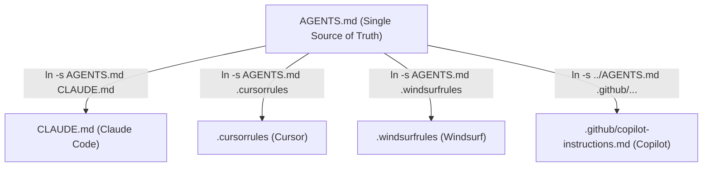

# Best Practices for Agent Instructions in `AGENTS.md`

> **A Guide to Deterministic, Token-Efficient, and Cross-Platform Instruction Design for AI Coding Agents.**

---

## Table of Contents
1. [The Core Dilemma: Why Natural Language Fails and Logic Programming Misses](#1-the-core-dilemma)
2. [Theoretical Foundations: How LLMs Process Operational Instructions](#2-theoretical-foundations)
3. [The 5 Core Patterns of Deterministic Instructions](#3-the-5-core-patterns-of-deterministic-instructions)
4. [Maximum Token Efficiency: The Agent Action Grammar (AAG)](#4-maximum-token-efficiency-the-agent-action-grammar-aag)
5. [Cross-LLM & Tool-Agnostic Architecture (Single Source of Truth)](#5-cross-llm--tool-agnostic-architecture)
6. [Practical Benchmark: 3 Levels of Instruction Density](#6-practical-benchmark)
7. [Author Checklist for Agent Instructions](#7-author-checklist)

---

## 1. The Core Dilemma

When designing steering rules for AI coding agents (such as Cursor, Claude Code, Antigravity, GitHub Copilot, or Cline), engineers often face a false dichotomy:



* **Why Unstructured Prose Fails:**  
  Natural language ("Please try to be cautious and check the memory before touching frozen files") relies on soft modals and conversational etiquette. For a probabilistic autoregressive model, this significantly lowers the attention probability that the rule will be strictly enforced during tool execution.
* **Why Formal Predicate Logic (e.g. Prolog) Fails:**  
  LLMs are *not* formal resolution engines or SAT solvers. To execute Prolog rules (`rule :- condition, \+ exception`), the model has to mentally simulate logic tree unification. This frequently induces logical fallacies (especially around closed-world negations) and discards the LLM’s primary strength: semantic generalization across synonymous file and code concepts.
* **The Sweet Spot:**  
  **Constrained Structured Language** — syntax derived from patterns that LLMs have encountered billions of times during pre-training: RFC 2119 imperatives, programming assertions, shell grammars, and tabular mapping matrices.

---

## 2. Theoretical Foundations: How LLMs Process Operational Instructions

### A. Attention and Positional Weighting
LLMs process instructions through self-attention heads. Structured layouts—such as markdown table cells (`| Intent | Tool | Prohibited |`) or key-value structures—establish significantly tighter token-to-token attention weights than nested, verbose compound sentences.

### B. The Tokenizer Problem: ASCII vs. Multi-Byte Unicode
Decorative unicode symbols and emojis (`➔`, `→`, `🧠`, `🚨`) might appear visually pleasing to humans, but introduce hidden degradation for LLMs:
* A single emoji often consumes **3 to 4 byte-pair tokens** (BPE).
* Non-standard unicode arrows frequently split across byte boundaries depending on the model's vocabulary.
* **Best Practice:** Use standard single-byte ASCII operators (`=>`, `!`, `*`, `ASSERT`). These represent exactly **1 token** and are already deeply wired into transformer causality weights.

### C. Contrastive Attention (Negative Constraints)
Without explicit boundaries, LLMs follow the path of least resistance (e.g., executing a generic `grep` over the entire repository). The most effective way to eliminate undesired behavior is through **contrastive pairs** (pairing mandatory actions with explicit prohibitions):
* Affirmative guidance alone (*"Search specifically"*) often yields broad scans anyway.
* Contrastive framing (*"DO: okf_search(limit=3)"* + *"DO NOT: list_dir or grep"*) eliminates ambiguity before generation starts.

---

## 3. The 5 Core Patterns of Deterministic Instructions

### Pattern 1: RFC 2119 Keywords (Imperative Rigor)
Enforce contractual clarity using standard uppercase modal verbs:

```markdown
- You MUST validate changes prior to completing a task.
- You MUST NOT / NEVER scan memory directories using raw file tools.
- PREFER native MCP tools OVER CLI execution.
```

### Pattern 2: Event-Driven Guard Clauses (Trigger ➔ Action)
Model behavioral rules as finite state transitions:

```markdown
### RULE: Pre-Edit Subsystem Check
- **TRIGGER**: Modifying code within `pkg/<subsystem>/`
- **CONDITION**: Subsystem has not been evaluated in the current task
- **ACTION**: Call `okf_search(for_path="path/")`
- **GUARDS**:
  - IF `hold` ➔ HARD STOP. Prompt human for confirmation.
  - IF `constraint` ➔ MUST adhere to all listed invariants.
  - IF `context` ➔ Proceed with awareness.
```

### Pattern 3: Native Tool Signatures
Express instructions in the exact invocation syntax used by tool-calling APIs:

```markdown
✅ okf_search(query="auth token", limit=3)
❌ "Execute a search for auth tokens in the system and limit it to 3 items"
```

### Pattern 4: Intent-to-Tool Mapping Matrices
Tables bind user intent, permitted tools, and forbidden actions with maximum spatial density:

| Intent / Operation | Primary (Native MCP) | Fallback (CLI) | Prohibited Action |
| :--- | :--- | :--- | :--- |
| **Search Knowledge** | `okf_search(query="...", limit=3)` | CLI: `okf search` | `grep_search` / `list_dir` |
| **Inspect Concept** | `okf_show(concept_id="...")` | CLI: `okf show` | `view_file` on raw files |
| **Check Code Scope** | `okf_search(for_path="...")` | CLI: `okf search --for-path` | Modifying without check |

### Pattern 5: Assertion Gates for Pipelines
For multi-step completion workflows, apply the programmatic `assert` primitive:

```markdown
## Task Completion Gate
1. IF arch_decisions => MUST okf_create(architecture/*)
2. IF concepts_mutated => MUST sync(log.md, index.md)
3. ASSERT(okf_validate(strict=true) == 0_err, ELSE=fix_before_exit)
```

---

## 4. Maximum Token Efficiency: The Agent Action Grammar (AAG)

To preserve context windows during long-running sessions, instructions can be compressed into a dense symbolic grammar natively understood by all modern LLMs:

### The 5 Primitive Operators of AAG:
1. **Scope:** `@path/` (defines filesystem boundary)
2. **Trigger:** `ON <event>:` (defines activating event)
3. **Implication:** `=>` (standard ASCII conditional flow)
4. **Assertion:** `ASSERT(cond, ELSE=action)` (strict barrier check)
5. **Negation:** `!` or `NEVER` (absolute prohibition)

### Complete Example in AAG Syntax:
```markdown
# AGENTS.md — OKF Memory v0.2 Protocol

## 1. Constraints (RFC 2119)
- MUST okf_search before code/concept generation.
- NEVER scan `knowledge/` via list_dir, grep, or raw file reads.
- NEVER claim `verified:` (declare `generated: {by, at}`).
- PREFER okf_* MCP over CLI commands.

## 2. Guard Clauses
- ON edit(@subsystem/):
    IF first_visit => okf_search(for_path=@subsystem/)
    IF hold => STOP("Subsystem frozen. Ask user.")
    IF constraint => MUST enforce(rules)
- ON user_query(architecture|facts|conventions):
    okf_search(query=keywords, limit=3) => okf_show(id) ONLY if relevant
    IF exists(concept) => PREFER okf_update OVER okf_create

## 3. Completion Pipeline (Sequential Gate)
1. IF arch_decisions => MUST okf_create(architecture/*)
2. IF concepts_mutated => MUST sync(log.md, index.md)
3. ASSERT(okf_validate(strict=true) == {errors: 0, warnings: 0}, ELSE=fix)
```

---

## 5. Cross-LLM & Tool-Agnostic Architecture

AI tools expect instruction files in fragmented vendor-specific locations:
* **Antigravity / Open Community:** `AGENTS.md`
* **Anthropic Claude Code:** `CLAUDE.md`
* **Cursor:** `.cursorrules` or `.cursor/rules/`
* **Windsurf:** `.windsurfrules`
* **GitHub Copilot:** `.github/copilot-instructions.md`

### The Single-Source-of-Truth Symlink Pattern
Instead of maintaining divergent copies across tools, define **one canonical `AGENTS.md`** at the repository root and symlink vendor configurations:

```bash
# Execute in repository root:
ln -s AGENTS.md CLAUDE.md
ln -s AGENTS.md .cursorrules
ln -s AGENTS.md .windsurfrules
mkdir -p .github && ln -s ../AGENTS.md .github/copilot-instructions.md
```



Every agent environment automatically ingests the identical ruleset with zero drift and zero duplication.

---

## 6. Practical Benchmark

### Level 1: Conversational Prose (Before) — ~140 Tokens
> When you finish a task, please review carefully whether you made any new architectural decisions. If you did, make sure to write them into the architecture directory. Afterwards, please ensure that the log file and index are updated. Finally, always run validation and make sure there are no remaining errors.

*Issue:* Soft, rhetorical, high likelihood of being skipped by the model under heavy context loads.

---

### Level 2: Structured Guard Clauses — ~80 Tokens
> ```markdown
> ### Completion Pipeline
> 1. **Architectural Review**:
>    - **CONDITION**: IF task produced new architectural decisions
>    - **ACTION**: MUST record under `knowledge/architecture/` using `okf_create`.
> 2. **Log & Index Sync**:
>    - **CONDITION**: IF concepts were created or updated
>    - **ACTION**: MUST sync `knowledge/log.md` and parent `index.md`.
> 3. **Validation Gate**:
>    - **ACTION**: MUST execute `okf_validate(strict=true)`.
>    - **CRITERION**: Exactly 0 errors and 0 warnings.
> ```

*Benefit:* Clear, unambiguous conditional structure.

---

### Level 3: AAG Micro-Syntax — ~30 Tokens (78% Token Reduction!)
> ```markdown
> ## Sequential Gate
> 1. IF arch_decisions => MUST okf_create(architecture/*)
> 2. IF concepts_mutated => MUST sync(log.md, index.md)
> 3. ASSERT(okf_validate(strict=true) == 0_err, ELSE=fix_before_exit)
> ```

*Benefit:* Pure operational density, zero lexical filler, identical semantic compliance.

---

## 7. Author Checklist for Agent Instructions

Before committing changes to `AGENTS.md`, verify the following gates:

- [ ] **No Soft Modals:** Replaced words like *"try to"*, *"should preferably"*, *"please"* with `MUST`, `PREFER`, or `NEVER`.
- [ ] **Concrete Activation Triggers:** Every rule specifies exactly **when** it triggers (`ON edit(...)`, `BEFORE task completion`).
- [ ] **Explicit Stop Conditions:** Defined hard-stop criteria where the agent must stop and prompt the user rather than guessing (`HARD STOP`).
- [ ] **Standard ASCII Operators:** Eliminated decorative multi-byte unicode symbols and emojis in favor of ASCII operators (`=>`, `!`, `*`).
- [ ] **Native Tool Signatures:** Tool calls include explicit parameter names (`tool(param=value)`).
- [ ] **Contrastive Anti-Patterns:** Dangerous habits are explicitly forbidden with `DO NOT` counterparts.
- [ ] **Cross-Platform Symlinks:** Verified symlinks for `CLAUDE.md`, `.cursorrules`, and `.github/copilot-instructions.md`.
