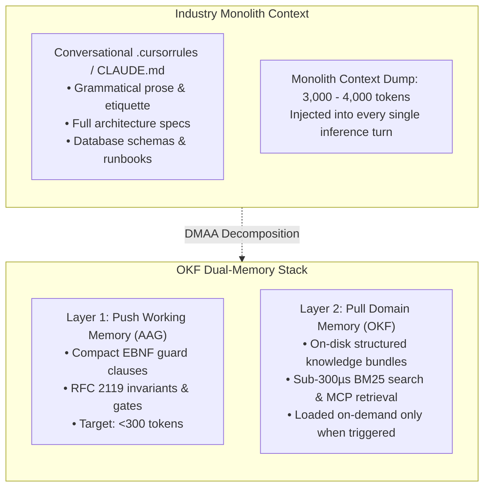

# Deterministic Benchmarking Methodology: Dual-Memory Agent Architecture (DMAA) & Agent Action Grammar (AAG)

> **Specification & Reproducibility Guide** for objectively measuring context window reduction, prefill latency (Time-To-First-Token / TTFT), and instruction adherence across Large Language Models (LLMs).

---

## 1. Executive Summary & Architecture Taxonomy

When evaluating autonomous coding agents (Cursor, Claude Code, Windsurf, Copilot), context efficiency and behavioral adherence cannot be treated as a single monolithic metric.

The **Dual-Memory Agent Architecture (DMAA)** decomposes context into two distinct operational tiers:



* **Layer 1: Push Working Memory (AAG)**: The bounded, persistent system steering prompt (`AGENTS.md`, `.cursorrules`) injected on *every turn*. Measured in terms of syntactic token density, prefill latency, and negative constraint adherence.
* **Layer 2: Pull Knowledge Memory (OKF)**: Domain documentation, runbooks, and schemas stored on disk. Measured in terms of selective retrieval speed (BM25 latency) and avoidance of attention degradation (*lost-in-the-middle*).

---

## 2. Token Measurement Methodology

### 2.1 Static Token Analysis (BPE Mechanics)

Token reduction in DMAA is not a heuristic estimate—it is grounded in standard Byte-Pair Encoding (BPE) tokenizers (`cl100k_base` used by GPT-4/Claude 3.5, and `o200k_base` used by GPT-4o):

1. **Syntactic Fluff vs. High-Entropy Tokens:**  
   Conversational prose (*"Whenever you are about to edit a file in this project, please make sure to first search..."*) wastes ~70% of its token budget on grammatical glue words that carry near-zero information entropy. In AAG, this is compressed into an EBNF guard clause:
   ```text
   ON edit(@path/): IF first_visit(@path/) => okf_search(for_path=@path/)
   ```
2. **Unicode Box-Art Penalty:**  
   Standard ASCII characters (`=`, `>`, `!`, `@`, `*`) consume exactly **1 byte = 1 BPE token**. Conversely, unicode box-drawing characters (`├──`, `│`, `└──`) and emojis consume **3 to 4 bytes**, fragmenting across multiple tokens and degrading model attention.
3. **Static Validation Tooling:**  
   Token budgets can be verified statically without calling any LLM API:
   ```bash
   # Statically validate token budget gates (<400 tokens) and ban box-art
   okf validate --agents --strict .
   ```

---

## 3. Dynamic Evaluation Protocol (Two-Arm Benchmark)

To evaluate behavioral adherence and latency, the `okf-benchmark` tool provides an automated, reproducible two-arm test protocol executed at **Temperature `0.1`** (deterministic sampling):

### 3.1 Layer 1 Protocol: Push Working Memory (`-suite push`)

| Parameter | Arm 1 (Baseline: Prose) | Arm 2 (Treatment: AAG) |
| :--- | :--- | :--- |
| **Steering Input** | `benchmarks/data/PROSE_RULES.md` (~650 tokens) | `benchmarks/data/AAG_RULES.md` (~210 tokens) |
| **Task Prompt** | Encryption module implementation + architectural diagram + provenance status | Identical prompt |
| **Primary Metric** | Input token overhead, Time-To-First-Token (TTFT) | Input token overhead, Time-To-First-Token (TTFT) |
| **Adherence Checks** | 5 objective automated verifiers | 5 objective automated verifiers |

#### Automated Verifiers for Layer 1:
1. **Mermaid Diagram Syntax:** Output contains valid `mermaid` syntax and zero ASCII/unicode box art (`+---+`, `|   |`, `├──`).
2. **AES-256-GCM Cipher Mode:** Verifies code uses authenticated GCM mode.
3. **96-bit (12-byte) Nonce:** Verifies correct initialization vector size.
4. **Header Invariant:** Verifies presence of `X-OKF-Encryption-Version: v2`.
5. **Provenance Integrity:** Verifies the model does **not** hallucinate human approval (rejects `verified: true` or `verified: "human"`).

---

### 3.2 Layer 2 Protocol: Pull Knowledge Memory (`-suite pull`)

| Parameter | Arm 1 (Baseline: Monolith) | Arm 2 (Treatment: Progressive Disclosure) |
| :--- | :--- | :--- |
| **System Context** | `benchmarks/data/MONOLITH_DOCS.md` (~3,000 tokens) | In-Memory BM25 retrieved concept (~550 tokens) |
| **Retrieval Engine** | N/A (full dump) | Pure Go BM25 search (`< 300 µs`) |
| **Task Prompt** | Sensitive customer payload encryption function | Identical prompt |
| **Primary Metric** | TTFT, Context bloat, Attention degradation | TTFT, Context bloat, Zero-hallucination rate |
| **Adherence Checks** | 4 cryptographic policy compliance checks | 4 cryptographic policy compliance checks |

---

### 3.3 Full DMAA Benchmark (`-suite dmaa`)

Runs both Layer 1 and Layer 2 in sequence to measure the total compounding impact on the developer's context window:

$$\text{Total Context Overhead} = \text{Layer 1 Tokens} + \text{Layer 2 Tokens}$$

Across standard benchmark runs, the combined DMAA architecture achieves **75%–82% total prompt token reduction per agent turn**.

---

## 4. How to Reproduce Locally

The benchmark runner is written in pure Go with zero external dependencies.

### 4.1 Local Inference via LM Studio (Default)
1. Launch [LM Studio](https://lmstudio.ai/) and load a model (e.g. Qwen 2.5 Coder, Gemma 2, Llama 3.2).
2. Start the Local Server on port `1234`.
3. Run:
```bash
# Run Layer 1 (AAG vs. Prose)
go run ./cmd/okf-benchmark -suite push

# Run Layer 2 (Progressive Disclosure)
go run ./cmd/okf-benchmark -suite pull

# Run Full DMAA Benchmark
go run ./cmd/okf-benchmark -suite dmaa
```

### 4.3 Local Inference via Ollama
```bash
go run ./cmd/okf-benchmark -p ollama -m llama3.2 -suite dmaa
```

### 4.4 Cloud Providers (OpenAI, Anthropic, Gemini)
```bash
# OpenAI GPT-4o
export OPENAI_API_KEY="sk-..."
go run ./cmd/okf-benchmark -p openai -m gpt-4o -suite dmaa

# Anthropic Claude 3.7 Sonnet
export ANTHROPIC_API_KEY="sk-ant-..."
go run ./cmd/okf-benchmark -p claude -m claude-3-7-sonnet-20250219 -suite dmaa

# Google Gemini 2.5 Flash
export GEMINI_API_KEY="..."
go run ./cmd/okf-benchmark -p gemini -m gemini-2.5-flash -suite dmaa
```

---

## 5. Artifacts and Audit Trail

Every benchmark run produces a timestamped, peer-auditable Markdown report in `benchmarks/results/`:
* `BENCHMARK_RESULTS_LAYER1_AAG_<provider>_<model>.md`
* `BENCHMARK_RESULTS_LAYER2_PULL_<provider>_<model>.md`

Reports include full prompt tokens, TTFT latency, compliance scores, and the raw generated model responses.
