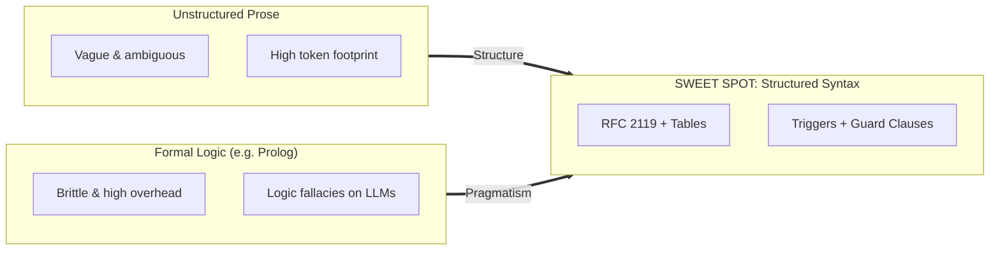

# Cheat Sheet: Deterministic Instructions for AI Agents

> **Objective:** Author instructions in `AGENTS.md` (as well as `.cursorrules`, `CLAUDE.md`, etc.) so that LLMs execute them with maximum reliability and minimal ambiguity—without resorting to unsuitable formal logic (such as Prolog).

---

## 1. The 6 Patterns for Maximum Determinism



---

### Pattern 1: RFC 2119 Keywords (Imperative Rigor)

Use **exclusively** uppercase standard modal verbs. LLMs prioritize these tokens as strict system boundaries.

| Term | Meaning for the Agent | Effect on LLM Attention |
| :--- | :--- | :--- |
| **`MUST`** | Absolute requirement. No exceptions allowed. | Prevents skipping intermediate steps. |
| **`MUST NOT` / `NEVER`** | Strict prohibition. Aborts immediately. | Highest priority for negative constraints. |
| **`SHOULD`** | Default path. Deviation requires justified rationale. | Permits flexibility on edge cases. |
| **`PREFER [A] OVER [B]`** | Prioritization between competing alternatives. | Resolves decision conflicts deterministically. |

---

### Pattern 2: Event-Driven Guard Clauses (Trigger ➔ Action)

Replace general advice with the **Event-Condition-Action (ECA)** paradigm:

```markdown
### RULE: Governance Check
- **TRIGGER**: Modifying files inside `pkg/<directory>/`
- **ACTION**: Run `okf_search(for_path="<directory>/")`
- **GUARD**:
  - IF governance is `hold` ➔ STOP IMMEDIATELY and request human confirmation.
  - IF governance is `constraint` ➔ MUST adhere to all listed constraints.
  - IF governance is `context` ➔ Proceed with awareness.
```

---

### Pattern 3: Contrast Pairs (DO vs. DO NOT)

LLMs eliminate ambiguity fastest through explicit contrastive examples:

```markdown
### Search Strategy
- ✅ **DO**:
  - `okf_search(query="auth token", limit=3)`
  - Query specific keywords and read descriptions first.
- ❌ **DO NOT**:
  - `grep -r "token" knowledge/` (Never blanket-scan memory files)
  - `list_dir("knowledge/")` (Never inspect raw storage directories)
```

---

### Pattern 4: Decision and Mapping Tables

Markdown tables enforce tight spatial semantic coupling across attention heads:

| Task / Intent | Primary Tool | Fallback / CLI | Prohibited Action |
| :--- | :--- | :--- | :--- |
| Query facts | `okf_search(query="...")` | `okf search "..." --limit 3` | Raw scanning of `knowledge/` |
| Inspect concept details | `okf_show(concept_id="...")` | `okf show <id>` | Direct opening with `view_file` |
| Update knowledge | `okf_update(...)` | `okf update <id>` | Manual overwrite via code editor |
| Validate conformance | `okf_validate(strict=true)` | `okf validate --strict` | Ignoring warnings or drift |

---

### Pattern 5: Pseudocode / Algorithms for Workflows

For multi-step operational sequences, pseudocode or structured YAML is vastly clearer than descriptive paragraphs:

```yaml
workflow_step:
  name: "Modifying Existing Subsystem"
  sequence:
    1_check: "okf_search(for_path=subsystem_path)"
    2_evaluate:
      on_hold: "abort(reason='Subsystem frozen by governance')"
      on_ok: "continue"
    3_execute: "apply_code_changes()"
    4_post_action:
      if_architecture_changed: "okf_create(type='decision', ...)"
      always: "okf_validate(strict=true)"
```

---

### Pattern 6: Stop Conditions (When the Agent MUST Halt)

Agents tend to make unverified assumptions when information is missing. Define hard-stop criteria:

```markdown
### 🛑 HARD STOP CONDITIONS (Ask User, Do NOT Guess)
1. When 2 or more competing implementation paths exist and no documentation dictates the choice.
2. When an external secret, API key, or credential login is required.
3. When an existing test fails before your modifications (Avoid fixing unrelated bugs without confirmation).
```

---

## 2. Practical Comparison: Before vs. After

### Example A: Knowledge Memory Handling

#### ❌ Before (Vague, open to interpretation)
> Please try to always look in our memory first to see if there is important information. Be conservative with queries and do not scan the whole disk. If you change anything, update the documentation.

#### ✅ After (Precise, deterministic)
> ```markdown
> ### Knowledge Retrieval Contract
> 1. **Search Before Write**:
>    - `MUST` execute `okf_search(query="<topic>", limit=3)` before proposing architecture or new dependencies.
> 2. **No Blanket Scans**:
>    - `NEVER` call `list_dir` or `grep_search` on `knowledge/`.
>    - `MUST` inspect summary metadata first; load full content with `okf_show(id)` only if relevant.
> 3. **Post-Change**:
>    - If architectural decisions were made: `MUST` record via `okf_create(type="decision", ...)`.
> ```

---

### Example B: Code Reviews and Governance

#### ❌ Before (Vague)
> When you touch code in critical modules, be careful whether there might be a freeze or existing guidelines.

#### ✅ After (Deterministic Guard Clause)
> ```markdown
> ### Scope Governance
> - **TRIGGER**: Target file is inside `pkg/` or `internal/`.
> - **STEP 1**: Execute `okf_search(for_path="<subsystem-dir>")`.
> - **STEP 2**: Evaluate response:
>   - CASE `hold`: STOP execution. Prompt: "Path is under freeze. Awaiting approval."
>   - CASE `constraint`: Incorporate rules into generation context.
>   - CASE `none`: Proceed with default standards.
> ```

---

## 3. Universal Template Structure for `AGENTS.md`

Ready-to-copy foundation for any codebase:

```markdown
# AGENTS.md — Agent Governance & Instructions

## 1. Operating Rules (RFC 2119)
- You MUST validate changes using `<test-command>` before marking a task complete.
- You MUST NOT introduce new third-party dependencies without explicit user confirmation.
- PREFER existing patterns in the codebase OVER external idioms.

## 2. Trigger-Action Table
| Trigger / Event | Mandatory Action | Prohibited Action |
| :--- | :--- | :--- |
| Editing module `X` | Query governance: `tool_check(X)` | Direct editing without check |
| Encountering test failure | Isolate failure with minimal test | Modifying unrelated test assertions |
| New architectural decision | Persist in `knowledge/` | Storing only in chat response |

## 3. Decision Tree / Guard Clauses
- IF `ambiguity_detected` > 0:
  - Formulate 2-3 concrete options with tradeoffs.
  - STOP and ask user. Do not guess.
- IF `all_tests_pass`:
  - Run linter and formatting.
  - Finalize task.

## 4. Anti-Patterns (DO vs. DO NOT)
- ✅ DO: Use targeted search queries with a limit of 3-5 results.
- ❌ DO NOT: Perform recursive scans or dumps of entire documentation directories.
```
