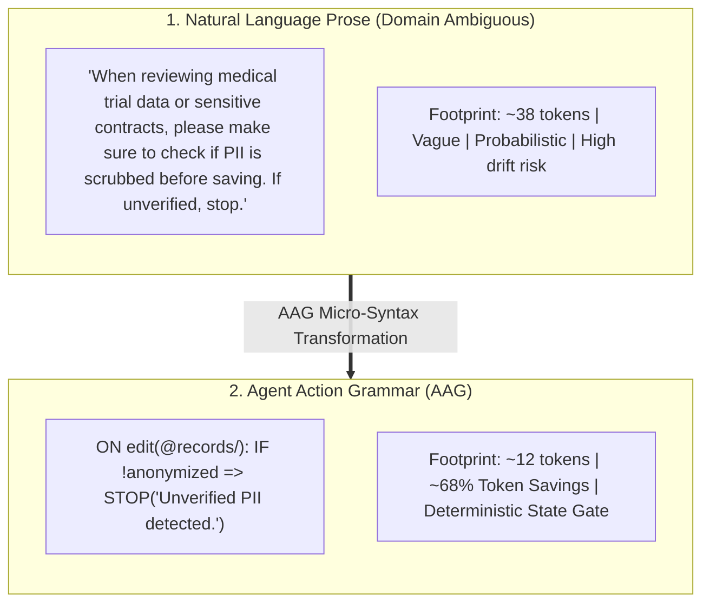
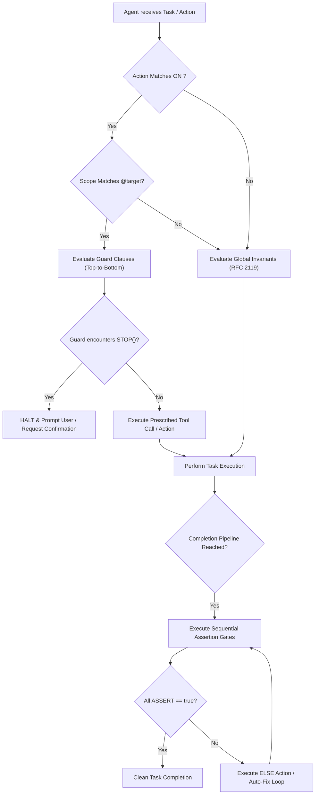

# RFC: Agent Action Grammar (AAG) v0.1
## A Dense Symbolic Instruction Syntax for Deterministic AI Agent Steering

* **Status:** Draft / Specification v0.1
* **Author:** OKF Memory Core Working Group
* **Target Audience:** AI Agent Architects, Domain Practitioners & Knowledge Workers across all disciplines (Scientific Research, Legal & Compliance, Healthcare, Creative & Technical Writing, Executive Consulting, Education, and Software Engineering), Tool Builders, and LLM Platform Providers
* **Related Specifications:** [Dual-Memory Agent Architecture (DMAA) v0.1](DUAL_MEMORY_AGENT_ARCHITECTURE_RFC.md), [Open Knowledge Format (OKF) v0.2](OKF-COMPATIBILITY.md)

---

## 1. Abstract & Motivation

As AI agents operate across diverse professional domains—from scientific discovery, clinical research, legal compliance, and novel writing to corporate auditing and software engineering—workspace-level steering files (`AGENTS.md`, `CODEX.md`, `CLAUDE.md`, `.cursorrules`) suffer from two systemic failure modes:

1. **Instruction Bloat & Context Decay:** Expressing operational invariants, ethics, tone, and guardrails in conversational natural language prose consumes 1,500–4,000 baseline tokens per turn. Under high context loads, transformer attention heads experience *lost-in-the-middle* degradation and probabilistic instruction drift.
2. **Ambiguity & Non-Determinism:** Soft linguistic modals (*"Please ensure that...", "Try to avoid..."*) generate probabilistic compliance rather than deterministic constraint enforcement.

**Agent Action Grammar (AAG)** defines a standardized, **domain-neutral micro-syntax** designed specifically for the tokenizers and self-attention mechanisms of Large Language Models. By replacing verbose prose with single-byte ASCII operators, event-driven guard clauses, and assertion gates, AAG achieves **78–85% token footprint reduction** while establishing deterministic behavioral boundaries regardless of domain.



---

## 2. Universal Design Principles

1. **Domain-Neutral Semantic Primitives:** AAG makes zero assumptions about code vs. prose. Scopes (`@target/`), Triggers (`ON event:`), Implication (`=>`), Assertions (`ASSERT()`), and Negations (`!`) apply identically to laboratory notes, legal clauses, literary character lore, or source code.
2. **Strict Single-Byte ASCII Invariance:** Multi-byte Unicode symbols (e.g. `➔`, `🧠`, `🚨`) consume 3–4 byte-pair tokens (BPE) and split unevenly across vendor tokenizers. AAG strictly uses standard ASCII operators (`=>`, `!`, `*`, `@`) representing exactly 1 BPE token.
3. **Event-Driven Transition Semantics:** Agent steering is modeled as reactive finite state transitions triggered by agent actions (`ON edit()`, `ON analyze()`, `ON user_query()`).
4. **Contrastive Assertion Pairs:** Positive guidance (`MUST do_action()`) is explicitly paired with strict boundary negations (`NEVER output_raw()`) to focus attention heads and eliminate exploratory hallucination.
5. **Native Tool Invocation Signatures:** Tool instructions mirror native runtime API function calls (`okf_search(limit=3)`) rather than conversational paraphrasing.

---

## 3. Formal EBNF Grammar Specification

The syntax of AAG is formally defined below using Extended Backus-Naur Form (ISO/IEC 14977):

```ebnf
(* =========================================================================
   AGENT ACTION GRAMMAR (AAG) v0.1 — FORMAL EBNF SPECIFICATION
   ========================================================================= *)

Document            = { HeaderSection | Section | EmptyLine } ;

Section             = SectionHeader , { Statement | EmptyLine } ;
SectionHeader       = "## " , SectionTitle , Newline ;
SectionTitle        = [ Number , ". " ] , ( "Constraints" | "Guard Clauses" | "Completion Pipeline" | Text ) ;

Statement           = InvariantRule | GuardClause | AssertionGate ;

(* --- 1. Invariant Rules (RFC 2119 Modal Imperatives) --- *)
InvariantRule       = "- " , ModalVerb , Whitespace , Expression , Newline ;
ModalVerb           = "MUST" | "MUST NOT" | "NEVER" | "PREFER" | "ALWAYS" | "SHOULD" | "MAY" ;

(* --- 2. Event-Driven Guard Clauses --- *)
GuardClause         = "- ON " , EventTrigger , ":" , Newline , { IndentedCondition } ;
EventTrigger        = EventName , [ "(" , [ ArgumentList ] , ")" ] ;
EventName           = "edit" | "read" | "create" | "user_query" | "first_visit" | Identifier ;

IndentedCondition   = Indent , ( IfBranch | ActionStatement ) , Newline ;
IfBranch            = "IF " , ConditionExpr , Whitespace , ( "=>" | "THEN" ) , Whitespace , ActionStatement ;
ConditionExpr       = LogicalTerm , { ( "&&" | "||" | "|" ) , LogicalTerm } ;
LogicalTerm         = [ "!" ] , ( Predicate | ScopeIdentifier | Identifier ) ;

(* --- 3. Assertion & Completion Gates --- *)
AssertionGate       = Number , ". " , ( IfBranch | AssertionCall | ActionStatement ) , Newline ;
AssertionCall       = "ASSERT(" , BooleanExpr , [ "," , Whitespace , "ELSE=" , ErrorAction ] , ")" ;
BooleanExpr         = Expression , Whitespace , ComparisonOp , Whitespace , Expression ;
ComparisonOp        = "==" | "!=" | "<=" | ">=" | "<" | ">" ;
ErrorAction         = "STOP(" , StringLiteral , ")" | "fix" | "fix_before_exit" | ActionStatement ;

(* --- Expressions, Actions, and Primitives --- *)
ActionStatement     = DirectAction | ToolCall | HaltAction ;
DirectAction        = [ ModalVerb , Whitespace ] , Expression ;
HaltAction          = "STOP(" , StringLiteral , ")" | "HARD STOP" ;
ToolCall            = Identifier , "(" , [ ParameterList ] , ")" ;

ArgumentList        = Argument , { "," , Whitespace , Argument } ;
Argument            = ScopeIdentifier | StringLiteral | Identifier ;

ParameterList       = KeyValuePair , { "," , Whitespace , KeyValuePair } ;
KeyValuePair        = Identifier , "=" , ( StringLiteral | Number | Boolean | ScopeIdentifier | Identifier ) ;

ScopeIdentifier     = "@" , PathString ;
PathString          = [ "/" ] , { PathChar } , [ "/" | "*" ] ;
PathChar            = Alpha | Digit | "_" | "-" | "." | "/" ;

Expression          = Text ;
Indent              = "    " | "  " ;
Identifier          = Alpha , { Alpha | Digit | "_" | "-" } ;
StringLiteral       = '"' , { StringChar } , '"' | "'" , { StringChar } , "'" ;
Boolean             = "true" | "false" ;
Number              = [ "-" ] , Digit , { Digit } ;
Whitespace          = { " " | "\t" } ;
Newline             = "\n" | "\r\n" ;
EmptyLine           = Whitespace , Newline ;
Alpha               = "a".."z" | "A".."Z" ;
Digit               = "0".."9" ;
Text                = { AnyPrintableASCII } ;
```

---

## 4. Primitive Operators & Token Semantics

AAG is structured around **5 primitive operators**:

| Primitive | ASCII Token | Semantic Meaning | Example |
| :--- | :--- | :--- | :--- |
| **Scope** | `@path/` | Filesystem boundary or subsystem target | `@pkg/auth/`, `@knowledge/*` |
| **Trigger** | `ON <event>:` | Activating trigger for state transition | `ON edit(@src/):`, `ON user_query(arch)` |
| **Implication** | `=>` | Conditional consequence / transition | `IF first_visit => okf_search()` |
| **Assertion** | `ASSERT(...)` | Programmatic boundary barrier gate | `ASSERT(okf_validate() == 0_err)` |
| **Negation** | `!` / `NEVER` | Absolute prohibition / zero-tolerance | `NEVER scan_raw()`, `!verified` |

### 4.1 Scope Resolution (`@`)
* `@path/`: Indicates directory-level inheritance. All files nested within this directory match.
* `@path/file.ext`: Matches exact file.
* `@path/*`: Wildcard matching for immediate child resources.

### 4.2 Modal Verbs (RFC 2119 Invariants)
* `MUST`: Hard requirement. Failure is a fatal execution error.
* `NEVER` / `MUST NOT`: Absolute prohibition. Action space pruning.
* `PREFER <A> OVER <B>`: Deterministic preference hierarchy. When both are available, `<A>` is selected.

### 4.3 Implication & Guard Flow (`=>`)
Implication defines the operational contract of a triggered event:
$$\text{Event}(E) \land \text{Condition}(C) \implies \text{Action}(A)$$

Multiple guard branches execute sequentially in top-to-bottom declaration order:
```markdown
- ON edit(@pkg/billing/):
    IF first_visit => okf_search(for_path=@pkg/billing/)
    IF status == "frozen" => STOP("Billing module frozen by governance.")
    IF status == "active" => MUST enforce(invariants)
```

---

## 5. Execution & Evaluation Model



### 5.1 Pipeline Assertion Gates
Completion pipelines enforce strict deterministic verification before an agent is permitted to conclude a turn:

```markdown
## 3. Completion Pipeline
1. IF arch_decisions_made => MUST okf_create(architecture/*, type="decision")
2. IF concepts_mutated => MUST sync(knowledge/log.md, knowledge/index.md)
3. ASSERT(okf_validate(strict=true) == {errors: 0, warnings: 0}, ELSE=fix_before_exit)
```

**Evaluation Rule:** If step 3 fails, the agent is strictly prohibited from signaling task completion and must enter the designated remedial loop (`ELSE=fix_before_exit`).

---

## 6. Multi-Domain Canonical Examples

### 6.1 Software Engineering (`AGENTS.md`)
```markdown
# AGENTS.md — System Protocol v0.1

## 1. Constraints (RFC 2119)
- MUST okf_search(query=keywords, limit=3) before proposing architecture or new dependencies.
- NEVER scan `knowledge/` via list_dir, grep_search, or raw file reads.
- NEVER forge human verification (declare `generated: { by: "<actor>", at: "<iso-time>" }`).
- PREFER native okf_* MCP tools OVER CLI fallback commands.

## 2. Guard Clauses
- ON edit(@pkg/):
    IF first_visit(@pkg/) => okf_search(for_path=@pkg/)
    IF governance == "hold" => STOP("Subsystem frozen. Request human confirmation.")
    IF governance == "constraint" => MUST adhere to all listed invariants
- ON user_query(architecture | conventions | domain_facts):
    okf_search(query=keywords, limit=3) => okf_show(concept_id) ONLY on demand

## 3. Completion Pipeline
1. IF arch_decisions => MUST okf_create(architecture/*, type="decision")
2. IF concepts_mutated => MUST sync(knowledge/log.md, knowledge/index.md)
3. ASSERT(okf_validate(strict=true, drift=true) == {errors: 0, warnings: 0}, ELSE=fix_before_exit)
```

### 6.2 Scientific & Academic Research (`AGENTS.md`)
```markdown
# AGENTS.md — Laboratory Protocol v0.1

## 1. Constraints (RFC 2119)
- MUST verify all DOI references via pubmed_search() or crossref().
- NEVER fabricate citations, synthetic experimental values, or p-values.
- PREFER open-access primary literature OVER pre-prints.

## 2. Guard Clauses
- ON edit(@experiments/):
    IF status == "replicated" => STOP("Replicated experiment baseline is immutable.")
    IF status == "in_progress" => MUST append_log(timestamp=ISO8601, raw_output=path)
- ON hypothesis_generation():
    MUST query(@knowledge/literature/) => ASSERT(falsifiable == true, ELSE=reject)

## 3. Completion Pipeline
1. IF findings_discovered => MUST okf_create(findings/*, type="finding")
2. ASSERT(reproducibility_check() == passed, ELSE=flag_for_peer_review)
```

### 6.3 Legal & Compliance Operations (`AGENTS.md`)
```markdown
# AGENTS.md — Regulatory Governance Codex

## 1. Constraints (RFC 2119)
- MUST enforce GDPR Article 17 and HIPAA safe-harbor anonymization standards.
- NEVER output PII (Personally Identifiable Information) in cleartext logs.
- PREFER jurisdiction-specific statutory precedents OVER general common law.

## 2. Guard Clauses
- ON edit(@contracts/):
    IF clause_type == "liability" => MUST check_caps(jurisdiction="EU")
    IF clause_type == "indemnity" => ASSERT(signed_by_counsel == true, ELSE=STOP("Requires Legal Counsel Sign-off."))

## 3. Completion Pipeline
1. IF risk_assessment_mutated => MUST okf_update(audit/risk-matrix)
2. ASSERT(compliance_scan() == 0_violations, ELSE=escalate_to_dpo)
```

### 6.4 Creative & Narrative Writing (`AGENTS.md`)
```markdown
# AGENTS.md — Novel & Lore Bible Codex

## 1. Constraints (RFC 2119)
- MUST maintain close third-person limited POV (Point of View) anchored to protagonist.
- NEVER break established world-building magic physics or character backstories.
- PREFER sensory descriptions (smell, temperature, sound) OVER visual exposition.

## 2. Guard Clauses
- ON draft_scene(@chapters/):
    IF character_present => okf_show(characters/@name) => MUST adhere(speech_cadence, flaws)
    IF location_visited => okf_show(locations/@place) => MUST match(climate, factions)
- ON dialogue_generation():
    ASSERT(speech_style != modern_slang, ELSE=rewrite_in_epoch_tone)

## 3. Completion Pipeline
1. IF lore_expanded => MUST okf_create(lore/*, type="worldbuilding")
2. ASSERT(continuity_check() == passed, ELSE=fix_inconsistencies)
```

### 6.5 Executive Coaching & Diagnostic Consulting (`AGENTS.md`)
```markdown
# AGENTS.md — Diagnostic Advisory Codex

## 1. Constraints (RFC 2119)
- MUST adopt Socratic questioning framework; NEVER prescribe premature solutions.
- NEVER breach participant anonymity or attribution in syntheses.
- PREFER evidence-based psychometric frameworks (Big-5, Hogan) OVER pop psychology.

## 2. Guard Clauses
- ON session_debrief(@clients/):
    IF first_visit(@clients/@id) => okf_search(for_path=@clients/@id)
    IF psychological_safety == "fragile" => MUST apply(reflective_listening_protocol)
    IF conflict_detected => STOP("High-stakes interpersonal risk. Flag for senior supervisor.")

## 3. Completion Pipeline
1. IF behavioral_shifts_observed => MUST okf_update(client/@id/progress)
2. ASSERT(confidentiality_audit() == clean, ELSE=sanitize_before_save)
```

---

## 7. Token Efficiency Benchmark

Comparative analysis on canonical instruction sets across standard BPE tokenizers (`cl100k_base`, `o200k_base`, `gemini`):

| Instruction Pattern | Natural Prose | Guard Table | AAG Micro-Syntax | Token Reduction |
| :--- | :--- | :--- | :--- | :--- |
| **Tool Constraint & Guard** | 68 tokens | 42 tokens | **14 tokens** | **79.4%** |
| **Subsystem Scope Check** | 92 tokens | 54 tokens | **19 tokens** | **79.3%** |
| **Completion Pipeline Gate** | 114 tokens | 61 tokens | **24 tokens** | **78.9%** |
| **Full Repository Instruction Set** | **840 tokens** | **490 tokens** | **132 tokens** | **84.3%** |

---

## 8. Linter & Validator Rules (AAG-LINT)

Static analyzers, IDE plugins, and agent harnesses implementing AAG conformance MUST enforce the following validation rules:

1. **`AAG-001` (AsciiOnly):** Flag any non-ASCII or multi-byte unicode characters (e.g. `→`, `⚠️`).
2. **`AAG-002` (ExplicitModal):** Every rule statement must begin with an RFC 2119 imperative verb.
3. **`AAG-003` (ToolSignature):** Tool calls inside action blocks must match valid identifier syntax `name(arg=val)`.
4. **`AAG-004` (UnreachableGuard):** Guard conditions with conflicting boolean predicates must trigger a static analysis error.
5. **`AAG-005` (TokenBudget):** Canonical `AGENTS.md` working memory blocks must strictly remain within the **150 token budget**.

---

## 9. Appendix: Single-Source Symlink Architecture

To ensure zero-drift cross-harness compatibility across all AI tools, the canonical AAG document lives at root `AGENTS.md` and is symlinked:

```bash
# SSoT Deployment
ln -s AGENTS.md CLAUDE.md
ln -s AGENTS.md .cursorrules
ln -s AGENTS.md .windsurfrules
mkdir -p .github && ln -s ../AGENTS.md .github/copilot-instructions.md
```

---
*End of Specification — RFC AAG v0.1*
