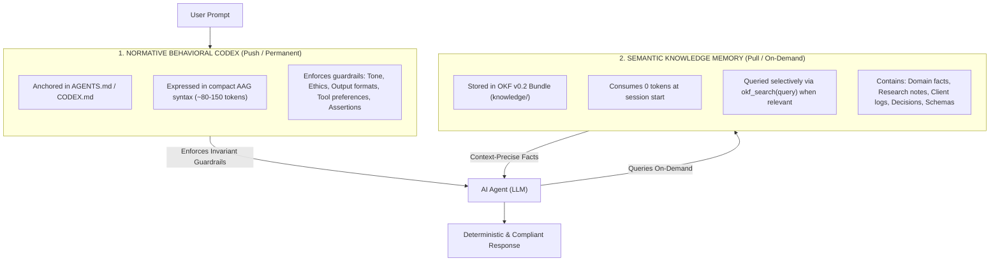
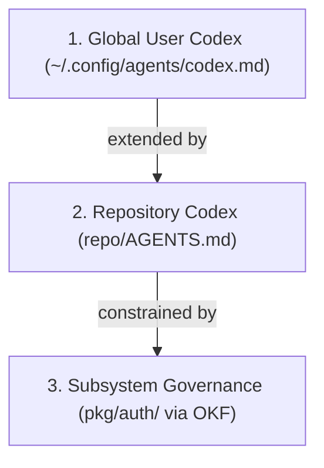

# RFC: Dual-Memory Agent Architecture (DMAA)

> **Specification:** Dual-Memory Agent Architecture (DMAA) v0.1  
> **Status:** Draft / Community Proposal  
> **Authors:** AI & Human Pair-Programming Co-Design  
> **OKF Concept ID:** `conventions/dual-memory-architecture`  
> **Target Audience:** AI Agent Architects, LLM Providers (Google, OpenAI, Anthropic), Tool Builders (Cursor, Windsurf, Claude Code, Cline), Researchers, Organizations, and Knowledge Creators across all domains

---

## 1. Abstract

Modern AI agents across all domains—from scientific research, enterprise governance, legal and medical analysis, executive coaching, to software engineering—face a critical context and memory architecture bottleneck:
1. **The Prompt Monolith:** All behavioral directives, domain methodologies, and reference facts are indiscriminately shoved into the system prompt. This leads to context bloat, runaway inference costs, and attention drift (the agent starts ignoring critical instructions).
2. **The RAG Blindspot:** Behavioral, ethical, and formatting rules are offloaded into vector databases or retrieval folders. Under standard user prompts, semantic search fails to surface operational rules (e.g., *"Always format citations in IEEE style"* or *"Never disclose client PII"* is never retrieved for a general subject query). The agent inevitably falls back to hallucinated formats.

The **Dual-Memory Agent Architecture (DMAA)** solves this dilemma through a strict, domain-neutral, cognitively grounded two-layer model:
* **Layer 1: Normative Working Memory (Push Layer):** A permanent, ultra-compact behavioral codex expressed in [**Agent Action Grammar (AAG)**](AGENT_ACTION_GRAMMAR_RFC.md) (~100 tokens) loaded into the context at session start. Defines project-specific rules, tone, ethics, and formatting constraints.
* **Layer 2: Semantic Knowledge Memory (Pull Layer):** A persistent, structured domain memory bundle adhering to **Open Knowledge Format (OKF v0.2)** that consumes 0 initial tokens and is retrieved selectively via native tool calling (`okf_search`).

---

## 2. Architectural Overview



---

## 3. Layer Specifications

### Layer 1: The Behavioral Codex (Push Layer)

* **Location:** Canonical `AGENTS.md` at repository root (symlinked to `CLAUDE.md`, `.cursorrules`, etc.).
* **Syntax:** Exclusively **Agent Action Grammar (AAG)** — no lexical padding, only dense, deterministic operators (`ASSERT`, `=>`, `!`, `MUST`).
* **Budget:** Strictly capped at **150–200 tokens**.
* **Composition Model:**
  $$\text{AGENTS.md} = \underbrace{\text{Project Codex (Domain Invariants)}}_{\text{Customizable rules in AAG}} + \underbrace{\text{OKF Memory Bridge}}_{\text{Standardized memory protocol}}$$
* **Domain Responsibilities:**
  - **Output Formats:** e.g., `diagrams => ASSERT(syntax == mermaid)` | `formulas => ASSERT(syntax == latex)`
  - **Communication & Tone:** e.g., technical directness, academic rigor, or coaching empathy
  - **Domain Guardrails:** e.g., strict typing (software), APA citation (research), HIPAA/GDPR constraints (healthcare/enterprise)
  - **Bootstrap Bridge:** The mandatory rule directing the agent to consult OKF memory when domain facts are needed.

#### Example of a Valid DMAA Codex across Different Domains (`AGENTS.md`):

##### A. General / Engineering Project:
```markdown
# AGENTS.md — DMAA Protocol v0.1

## 0. Project Invariants
- CODE: enforce(clean_architecture, strict_typing)
- FORMAT: diagrams => ASSERT(syntax == mermaid)

## 1. Memory Bridge & Governance
- KNOWLEDGE: ON architectural_task|domain_query => MUST okf_search(query)
- GOVERNANCE: ON edit(@subsystem/): IF hold => STOP("Subsystem frozen")
```

##### B. Scientific Research / Academic Project:
```markdown
# AGENTS.md — DMAA Protocol v0.1

## 0. Research Invariants
- CITATIONS: ASSERT(format == "APA-7th", sources >= 1)
- METHODOLOGY: ON claim_made => MUST cite_evidence(peer_reviewed)

## 1. Memory Bridge
- KNOWLEDGE: ON literature_review|hypothesis => MUST okf_search(query=keywords, limit=3)
```

---

### Layer 2: Semantic Knowledge Memory (Pull Layer)

* **Location:** Standardized `knowledge/` bundle adhering to **OKF v0.2**.
* **Characteristics:**
  - Typed concepts (`decision`, `architecture`, `convention`, `fact`).
  - Deterministic tooling (`okf_search`, `okf_show`, `okf_validate`).
  - Strictly version-controlled and enduring across conversational resets.
* **Token Footprint:** **0 tokens** in the baseline system prompt.
* **Responsibilities:**
  - System architecture and domain models.
  - Architecture Decision Records (ADRs).
  - Subsystem constraints and freeze governance (`governance: hold`).

---

## 4. Hierarchical Scoping (Context Switching Across Environments)

Just as humans navigate different social contexts (personal, office, open-source communities), DMAA defines a hierarchical inheritance tree:



1. **Global User Codex:** Developer ergonomics (preferred shell flags, keyboard shortcuts, preferred languages).
2. **Repository Codex:** Team invariants (Mermaid diagrams only, PR formatting, test coverage thresholds).
3. **Subsystem Governance:** Module-level constraints (e.g., `hold` on core billing or crypto libraries).

---

## 5. Benefits for LLM Providers and Agent Harnesses

Widespread adoption by major providers (Google, OpenAI, Anthropic) and agent harnesses (Cursor, Windsurf):

1. **Massive Cost & Latency Reduction:** Baseline prompts shrink from thousands of tokens to ~100 tokens, lowering Time-To-First-Token (TTFT).
2. **Elimination of Prompt Drift:** By keeping behavioral rules in high-density AAG tokens, attention layers retain 100% compliance even after long multi-turn sessions.
3. **Universal Interoperability:** Teams write their conventions and knowledge once; any compliant agent harness executes them identically.

---

## 6. Next Steps & Community Engagement

1. **RFC Publication:** Shared across open-source communities (OKF-Memory, Open Agent Standards).
2. **Reference Implementation:** This repository (`okf-agent-memory`) serves as the working proof of concept.
3. **Validation Tooling:** Integrated into automated bundle checks (`okf_validate --strict`).
