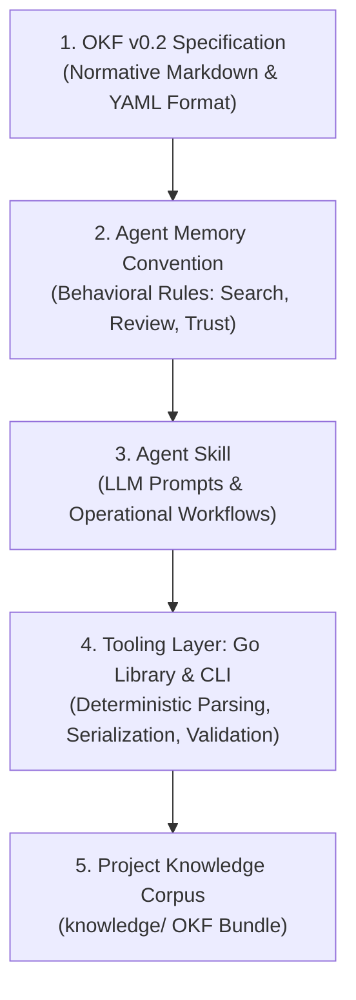

# 5-Layer System Architecture

OKF Agent Memory strictly separates semantic reasoning from syntax handling through a 5-layer stack.[^roadmap]

## Layer Responsibilities

### 1. OKF v0.2 Specification
The data representation contract. Defines concept frontmatter (`type`, `sources`, `generated`, `verified`, `status`), index files, and `log.md`.

### 2. Agent Memory Convention
Defines agent behavior around the format without altering OKF syntax.[^convention] Governed by [convention/principles](../convention/principles.md) and [convention/lifecycle](../convention/lifecycle.md).

### 3. Agent Skill
Teaches an AI agent *how* and *when* to execute memory operations (e.g. running search queries, discovering relevant concepts, structuring updates). Connects to the broader project as described in [project/overview](../project/overview.md).

### 4. Tooling Layer (Go Library & CLI)
Ensures format correctness, validates links, maintains index files, and manages frontmatter metadata deterministically without placing parsing burdens on the LLM, as decided in [tooling-decision](tooling-decision.md). Tracked under [roadmap/milestones](../roadmap/milestones.md).

### 5. Project Knowledge Corpus
The version-controlled `knowledge/` directory holding the actual durable concepts, cross-links, and change log.

[^roadmap]: OKF Agent Memory Project Roadmap
[^convention]: OKF Agent Memory Convention v0.1

# Related Concepts
- [Bundle Isolation and Mutation Security Boundaries](security-boundaries.md): Layer 4 tooling enforces security boundaries and bundle isolation
- [Engineering & Coding Best Practices (Clean Code, TDD, DRY)](../convention/coding-standards.md): Coding standards governing Layer 4 Go tooling development
