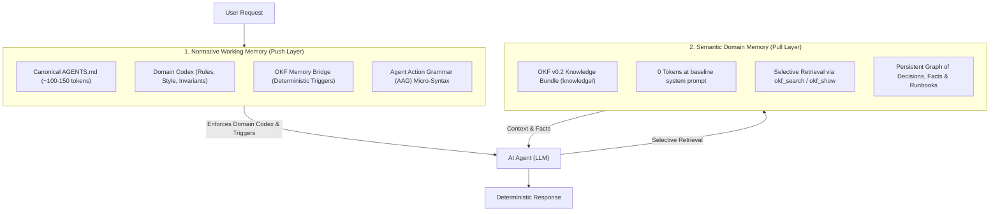

# Dual-Memory Agent Architecture (DMAA) & Agent Action Grammar (AAG)

The **Dual-Memory Agent Architecture (DMAA) v0.1** resolves the context-bloat and attention-drift dilemma across AI agents in all domains through a 2-layer cognitive model.[^dmaa-rfc]

## The Universal Composition Model

In DMAA, project-level agent configuration is governed by a universal equation:

$$\text{AGENTS.md} = \text{Domain Codex} + \text{OKF Memory Bridge}$$

1. **Domain Codex (AAG)**: Project-specific behavioral invariants, tone, ethical boundaries, and hard constraints expressed in dense Agent Action Grammar.
2. **OKF Memory Bridge**: Standardized deterministic triggers directing the agent to pull from and synchronize with `knowledge/`.

## Layer 1: Normative Working Memory (Push Layer)
* **Location:** `AGENTS.md` at project root (symlinked to `CLAUDE.md`, `.cursorrules`, etc.).
* **Language:** **Agent Action Grammar (AAG)** — dense ASCII micro-syntax (`=>`, `ASSERT`, `!`, `MUST`, `IF`, `ON`) replacing verbose natural language prose (~78–85% token reduction).[^best-practices]
* **Budget:** Strictly capped at **100–150 tokens**.
* **Responsibility:** Invariant formatting, behavioral guardrails, and deterministic search-before-write triggers.

## Layer 2: Semantic Domain Memory (Pull Layer)
* **Location:** `knowledge/` OKF v0.2 bundle.
* **Footprint:** **0 tokens** in initial system prompt.
* **Responsibility:** Persistent domain facts, architectural decisions, runbooks, experimental logs, client records, and domain taxonomies retrieved on-demand.

## Multi-Domain Applicability

DMAA is completely domain-neutral and serves diverse industries and audiences:
- **Scientific & Academic Research**: Laboratory invariants, citation standards, data integrity gates; hypotheses, methodology logs, and findings stored in `knowledge/`.
- **Enterprise, Legal & Compliance**: Regulatory boundaries, confidentiality rules, audit requirements; corporate policies, contract precedents, and risk assessments in `knowledge/`.
- **Coaching & Consulting**: Pedagogical frameworks, diagnostic posture, conversational guardrails; client session histories and interventions in `knowledge/`.
- **Creative & Technical Writing**: Voice guidelines, stylistic rules, terminology bans; world-building lore, plot outlines, and character sheets in `knowledge/`.
- **Software Engineering**: Architectural guardrails, coding conventions, testing assertions; ADRs, schema designs, and operational runbooks in `knowledge/`.

## Inter-Concept Connections
* Extends the core principles in [principles](principles.md) with compact agent instruction standards.
* Complements the 5-layer architecture in [architecture/layers](../architecture/layers.md).
* Direct link to ecosystem value proposition in [project/value-proposition](../project/value-proposition.md).

[^dmaa-rfc]: RFC Dual-Memory Agent Architecture (DMAA) v0.1
[^best-practices]: Best Practices for Agent Instructions in AGENTS.md

# Related Concepts
- [Core Memory Principles & Agent Contract](principles.md): Specializes behavioral invariants into two cognitive memory layers
- [5-Layer System Architecture](../architecture/layers.md): Defines Layer 1 push working memory and Layer 2 pull domain memory
- [Why OKF Agent Memory (Value Proposition & Selling Points)](../project/value-proposition.md): Value proposition of token efficiency and domain neutrality

