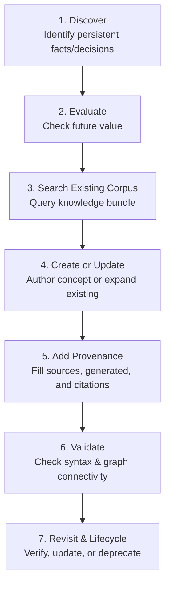

# Knowledge Lifecycle & Review Workflow

Persistent knowledge moves through a well-defined lifecycle to prevent corpus rot and maintain coherence with the principles in [principles](principles.md).[^convention]

## The 7-Stage Lifecycle

## The Read-Before-Write Execution Sequence

For any substantial task, an agent follows this protocol:

1. **Identify the task**: Determine scope and goals.
2. **Discover relevant existing knowledge**: Read relevant concepts starting from index files.
3. **Inform execution**: Use loaded knowledge to avoid repeating past mistakes.
4. **Perform the task**: Complete code, research, or operational actions.
5. **Knowledge review**: Ask key reflective questions:
   - What did I learn or discover?
   - Did I make an important decision or change assumptions?
   - Did I create new artifacts or relationships?
6. **Create or update knowledge**: Write or update concepts and append dated entries in `log.md`.
7. **Validate the corpus**: Run conformance verification as described in [architecture/layers](../architecture/layers.md).

Overall roadmap progress is tracked in [roadmap/milestones](../roadmap/milestones.md).

[^convention]: OKF Agent Memory Convention v0.1
