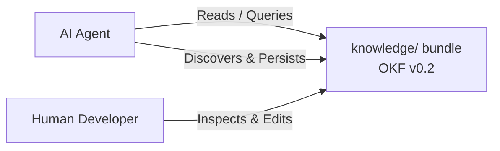

# OKF Agent Memory

The **OKF Agent Memory** project provides an open, vendor-neutral, and domain-agnostic persistent memory layer for AI agents, built directly on Google's Open Knowledge Format (OKF) v0.2.[^spec]

## Problem & Vision

Conversations with AI agents are temporary and ephemeral. When a context window resets or a new session starts, valuable discoveries, architectural decisions, and domain facts are lost unless stored systematically.[^convention]

Traditional solutions often rely on proprietary vector databases, locked memory APIs, or unstructured scratchpads. OKF Agent Memory solves this by treating an OKF knowledge bundle inside the repository (`knowledge/`) as the single source of persistent truth.

## Key Capabilities

- **Domain-Neutral**: Functions equally well for software engineering, coaching, research, literature reviews, and operations.[^convention]
- **Core Value Proposition**: Key differentiators and selling points detailed in [value-proposition](value-proposition.md).
- **Deterministic Tooling & Separation of Concerns**: Described in detail in [architecture/layers](../architecture/layers.md).
- **Principled Knowledge Lifecycle**: Defined in [convention/principles](../convention/principles.md) and [convention/lifecycle](../convention/lifecycle.md).
- **Phased Implementation**: Detailed in the [roadmap/milestones](../roadmap/milestones.md).

[^spec]: Open Knowledge Format (OKF) v0.2 Specification
[^convention]: OKF Agent Memory Convention v0.1
