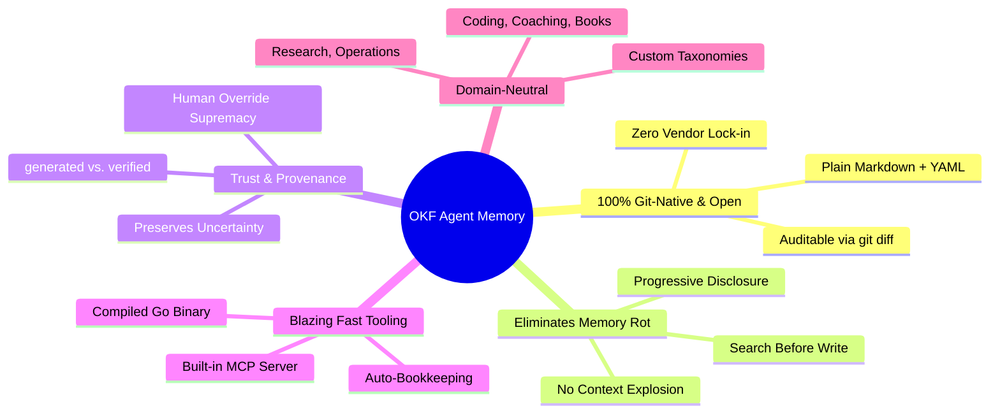

# Why OKF Agent Memory? — Key Selling Points & Value Proposition

The **OKF Agent Memory** project provides a modern, standardized, and portable alternative to proprietary vector memory services and unstructured flat markdown files.

---

## 1. Zero Vendor Lock-in & 100% Git-Native
- **Everything is a file**: All knowledge lives in standard Markdown files with YAML frontmatter inside the repository (`knowledge/`).
- **No external database required**: No Pinecone, Weaviate, or Postgres infrastructure needed to run, review, or edit memory.
- **Full human-in-the-loop control**: Complete auditability via standard `git log` and `git diff`.

## 2. Built on an Open Standard (Google OKF v0.2)
- Leverages the open, vendor-neutral **Open Knowledge Format (OKF) v0.2** specification.
- Compatible with any AI provider (Anthropic Claude, Google Gemini, OpenAI GPT, local LLMs) and IDE (Cursor, VS Code, JetBrains).

## 3. Solves Context Bloat & Memory Rot
- **Progressive Disclosure**: Agents navigate via structured `index.md` files and relative concept links, loading only the exact context required instead of dumping megabytes of text into the prompt.
- **Search-Before-Write**: Strictly prevents duplicated or contradictory entries by mandating that agents search existing concepts before creating new ones.

## 4. Built-in Trust & Provenance Layer
- **Explicit Trust Tiers**: Clear separation between `generated` (written by an agent) and `verified` (confirmed by a human or test process).
- **Preserves Uncertainty**: Distinguishes direct evidence from agent inference, preventing hallucinations from becoming canonical project truth.

## 5. High-Performance, Zero-Dependency Tooling (Go CLI & MCP)
- **Sub-Millisecond Execution Performance**:
  - **In-Memory BM25 Search**: Instant ranked concept retrieval in **< 300 µs** (microseconds).
  - **Full Bundle Loading & Graph Parsing**: Loads 50+ concepts, builds bidirectional dependency graphs, and checks link integrity in **~4 ms**.
  - **Single Native Binary**: Zero runtime dependencies, no Python VM or Node/Deno startup overhead (instant `< 5ms` CLI invocations vs. `150–400ms` runtime boot latency).
- **Native OKF v0.2 Validator**: Complete native Go engine of Google's specification and graph validator, executing strict conformance checks in sub-millisecond time.
- **Zero API Costs for Memory Retrieval**: Local lexical BM25 indexing eliminates recurring vector embedding API costs and network roundtrips.
- **Self-Contained Single Binary**: Ships with embedded skills and templates (`//go:embed`), instantly runnable across macOS, Linux, and Windows via `okf bootstrap`.
- **Native MCP Server (`okf mcp`)**: Plug-and-play Model Context Protocol integration over stdio for Claude Code, Cursor, and any MCP-compliant agent client with zero daemon overhead.
- **Automatic Bookkeeping**: Deterministically maintains `log.md` change logs and `index.md` navigation listings during write operations.

## 6. Truly Domain-Neutral
- Designed from the ground up to support diverse workflows:
  - **Software Engineering**: Architectural decisions, API discoveries, debugging runbooks.
  - **Coaching & Consulting**: Client histories, session insights, goal tracking.
  - **Research & Writing**: Literature reviews, citation tracking, reading histories.
  - **Operations & DevOps**: Incident post-mortems, playbooks, environmental constraints.

## 7. Clean Separation of Cognition vs. Syntax
- The LLM focuses purely on **understanding, synthesizing, and reasoning**.
- Deterministic Go tooling guarantees **syntax correctness, link integrity, and format conformance**.

---

## Related Knowledge
- [OKF Agent Memory Overview](overview.md)
- [5-Layer System Architecture](../architecture/layers.md)
- [Go Tooling Architecture Decision](../architecture/tooling-decision.md)
- [Core Memory Principles & Agent Contract](../convention/principles.md)
